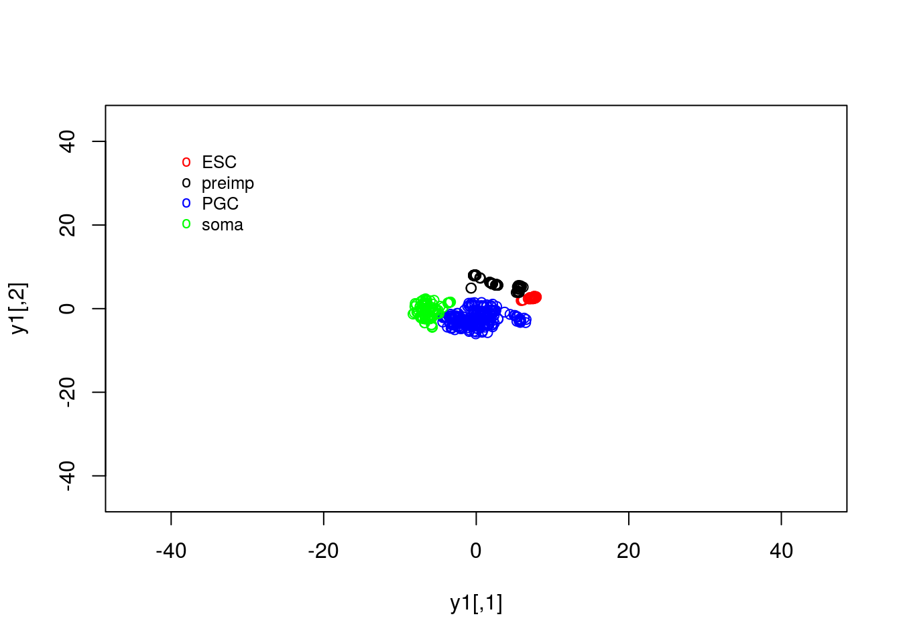
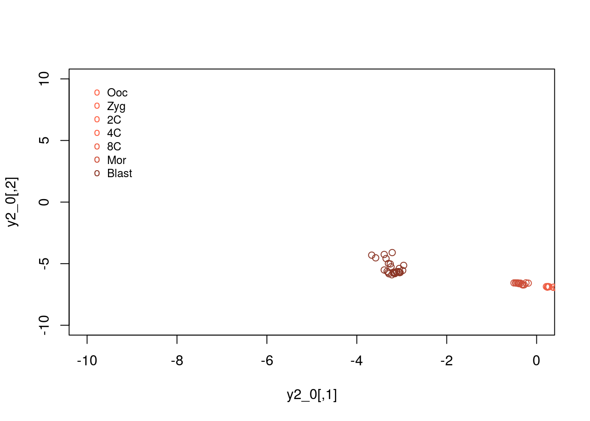

# Solutions ch. 5 - Dimensionality reduction {#solutions-dimensionality-reduction}

Solutions to exercises of chapter \@ref(dimensionality-reduction).

## Exercise 5.1

We can read the data in using the following command:


```r
D <- read.csv(file = "data/PGC_transcriptomics/PGC_transcriptomics.csv", header = TRUE, sep = ",", row.names=1)
genenames <- rownames(D)
genenames <- genenames[4:nrow(D)]
```

This reads in the corresponding spreadsheet into the R environment as a data frame variable. 

## Exercise 5.2

We will first run PCA on the data. Recall that the data is already log_2 normalised, with expression values beginning from row 4. Within R we would run:


```r
pcaresult <- prcomp(t(D[4:nrow(D),1:ncol(D)]), center = TRUE, scale. = FALSE)
```

Here we have opted to centre the data, but have not normalised each gene to be zero-mean. This is beacuse we are dealing entirely with gene expression, rather than a variety of variables that may exist on different scales. 

We can extract the positions of individual cells from the \texttt{pcaresult$x} variable. In the snipped below we index the different cells types (ESC, pre-implantation cells, primordial germ cells and somatic cells) for easier plotting. 


```r
y1 <- pcaresult$x[which(D[1,]==-1),1:2] # PCA
y2 <- pcaresult$x[which(D[1,]==0),1:2]  #
y3 <- pcaresult$x[which(D[1,]==1),1:2]  #
y4 <- pcaresult$x[which(D[1,]==2),1:2]  #
```

Finally, we can plot the data as follows:


```r
plot(y1,type="p",col="red",xlim=c(-100, 100),ylim=c(-50, 50))
points(y2,type="p",col="black")
points(y3,type="p",col="blue")
points(y4,type="p",col="green")
legend(-95, 50, legend=c("ESC", "preimp", "PGC", "soma"), col=c("red", "black", "blue", "green"), pch="o", bty="n", cex=0.8)
```


From the plot, we can see PCA has done a reasonable job of separating out various cells. For example, a cluster of PGCs appears at the top of the plot, with somatic cells towards the lower right hand side. Pre-implantation embryos and ESCs appear to cluster together: perhaps this is not surprising as the ESCs are derived from blastocyst cells. Loosely, we can interpret the PC1 as dividing pre-implantation cells from somatic cells, with PC2 separating out PGCs.

## Exercise 5.3. 

In the previous exercise we used PCA to reduce the dimensionality of our data from thousands of genes down to two principle components. By eye, PCA appeared to do a reasonable job separating out different cell types. A useful next step might therefore be to perform clustering on the reduced dimensional space, which can be done using:


```r
clust <- kmeans(pcaresult$x[,1:2], 4, iter.max = 1000)
```

We can now compare the cluster assignment to the known cell types:


```r
Labels <- vector("character", ncol(D))
Labels[which(D[1,]==-1)] = "ESC"
Labels[which(D[1,]==0)] = "preimp"
Labels[which(D[1,]==1)] = "PGC"
Labels[which(D[1,]==2)] = "soma"

clusterresults <- rbind(Labels,clust$cluster)
```

We note that, in general PGCs fall into one or more separate clusters, with soma also separating out well. ESCs and pre-implantation tend to fall into identical clusters. We can take a look at what cell types fall into a specific cluster:


```r
clusterresults[1,which(clusterresults[2,]==1)]
```

```
## PGC.109 PGC.111 PGC.144 PGC.145 PGC.202 PGC.203 PGC.204 PGC.206 PGC.208 
##   "PGC"   "PGC"   "PGC"   "PGC"   "PGC"   "PGC"   "PGC"   "PGC"   "PGC" 
## PGC.209 PGC.210 PGC.211 PGC.212 PGC.213 PGC.214 PGC.215 PGC.216 PGC.218 
##   "PGC"   "PGC"   "PGC"   "PGC"   "PGC"   "PGC"   "PGC"   "PGC"   "PGC" 
## PGC.219 PGC.220 PGC.221 PGC.222 PGC.223 PGC.224 PGC.225 PGC.226 PGC.227 
##   "PGC"   "PGC"   "PGC"   "PGC"   "PGC"   "PGC"   "PGC"   "PGC"   "PGC" 
## PGC.228 PGC.229 PGC.230 PGC.231 PGC.232 
##   "PGC"   "PGC"   "PGC"   "PGC"   "PGC"
```

```r
clusterresults[1,which(clusterresults[2,]==2)]
```

```
## preimp.51    ESC.31   PGC.192   PGC.193   PGC.194   PGC.196   PGC.197 
##  "preimp"     "ESC"     "PGC"     "PGC"     "PGC"     "PGC"     "PGC" 
##   PGC.199   PGC.200   PGC.201      soma    soma.1    soma.2    soma.3 
##     "PGC"     "PGC"     "PGC"    "soma"    "soma"    "soma"    "soma" 
##    soma.4    soma.5    soma.6    soma.7    soma.8    soma.9   soma.10 
##    "soma"    "soma"    "soma"    "soma"    "soma"    "soma"    "soma" 
##   soma.11   soma.12   soma.13   soma.14   soma.15   soma.16   soma.17 
##    "soma"    "soma"    "soma"    "soma"    "soma"    "soma"    "soma" 
##   soma.18   soma.19   soma.20   soma.21   soma.22   soma.23   soma.24 
##    "soma"    "soma"    "soma"    "soma"    "soma"    "soma"    "soma" 
##   soma.25   soma.26   soma.27   soma.28   soma.29   soma.30   soma.31 
##    "soma"    "soma"    "soma"    "soma"    "soma"    "soma"    "soma" 
##   soma.32   soma.33   soma.34   soma.35   soma.36   soma.37   soma.38 
##    "soma"    "soma"    "soma"    "soma"    "soma"    "soma"    "soma" 
##   soma.39   soma.40   soma.41   soma.42   soma.43   soma.44   soma.45 
##    "soma"    "soma"    "soma"    "soma"    "soma"    "soma"    "soma" 
##   soma.46   soma.47   soma.50   soma.53   soma.54   soma.55   soma.56 
##    "soma"    "soma"    "soma"    "soma"    "soma"    "soma"    "soma" 
##   soma.57   soma.58   soma.59   soma.60   soma.61   soma.62   soma.63 
##    "soma"    "soma"    "soma"    "soma"    "soma"    "soma"    "soma" 
##   soma.64   soma.65   soma.66   soma.67   soma.68   soma.69   soma.70 
##    "soma"    "soma"    "soma"    "soma"    "soma"    "soma"    "soma" 
##   soma.71   soma.72   soma.73   soma.74   soma.75   soma.76   soma.77 
##    "soma"    "soma"    "soma"    "soma"    "soma"    "soma"    "soma" 
##   soma.78   soma.79   soma.80   soma.81   soma.82   soma.83   soma.84 
##    "soma"    "soma"    "soma"    "soma"    "soma"    "soma"    "soma" 
##   soma.85 
##    "soma"
```

```r
clusterresults[1,which(clusterresults[2,]==3)]
```

```
##    preimp  preimp.1  preimp.2  preimp.3  preimp.4  preimp.5  preimp.6 
##  "preimp"  "preimp"  "preimp"  "preimp"  "preimp"  "preimp"  "preimp" 
##  preimp.7  preimp.8  preimp.9 preimp.10 preimp.11       ESC     ESC.1 
##  "preimp"  "preimp"  "preimp"  "preimp"  "preimp"     "ESC"     "ESC" 
## preimp.12 preimp.13 preimp.14 preimp.15 preimp.16 preimp.17 preimp.18 
##  "preimp"  "preimp"  "preimp"  "preimp"  "preimp"  "preimp"  "preimp" 
## preimp.19 preimp.20 preimp.21 preimp.22 preimp.23 preimp.24 preimp.25 
##  "preimp"  "preimp"  "preimp"  "preimp"  "preimp"  "preimp"  "preimp" 
## preimp.26 preimp.27 preimp.28 preimp.29 preimp.30 preimp.31 preimp.32 
##  "preimp"  "preimp"  "preimp"  "preimp"  "preimp"  "preimp"  "preimp" 
## preimp.33 preimp.34 preimp.35 preimp.36 preimp.37 preimp.38 preimp.39 
##  "preimp"  "preimp"  "preimp"  "preimp"  "preimp"  "preimp"  "preimp" 
## preimp.40 preimp.41 preimp.42 preimp.43 preimp.44 preimp.45 preimp.46 
##  "preimp"  "preimp"  "preimp"  "preimp"  "preimp"  "preimp"  "preimp" 
## preimp.47 preimp.48 preimp.49 preimp.50 preimp.52 preimp.53 preimp.54 
##  "preimp"  "preimp"  "preimp"  "preimp"  "preimp"  "preimp"  "preimp" 
## preimp.55 preimp.56 preimp.57 preimp.58 preimp.59 preimp.60 preimp.61 
##  "preimp"  "preimp"  "preimp"  "preimp"  "preimp"  "preimp"  "preimp" 
## preimp.62 preimp.63 preimp.64 preimp.65 preimp.66 preimp.67 preimp.68 
##  "preimp"  "preimp"  "preimp"  "preimp"  "preimp"  "preimp"  "preimp" 
## preimp.69 preimp.70 preimp.71 preimp.72 preimp.73 preimp.74 preimp.75 
##  "preimp"  "preimp"  "preimp"  "preimp"  "preimp"  "preimp"  "preimp" 
## preimp.76 preimp.77 preimp.78 preimp.79 preimp.80 preimp.81 preimp.82 
##  "preimp"  "preimp"  "preimp"  "preimp"  "preimp"  "preimp"  "preimp" 
## preimp.83 preimp.84 preimp.85 preimp.86 preimp.87 preimp.88 preimp.89 
##  "preimp"  "preimp"  "preimp"  "preimp"  "preimp"  "preimp"  "preimp" 
##     ESC.2     ESC.3     ESC.4     ESC.5     ESC.6     ESC.7     ESC.8 
##     "ESC"     "ESC"     "ESC"     "ESC"     "ESC"     "ESC"     "ESC" 
##     ESC.9    ESC.10    ESC.11    ESC.12    ESC.13    ESC.14    ESC.15 
##     "ESC"     "ESC"     "ESC"     "ESC"     "ESC"     "ESC"     "ESC" 
##    ESC.16    ESC.17    ESC.18    ESC.19    ESC.20    ESC.21    ESC.22 
##     "ESC"     "ESC"     "ESC"     "ESC"     "ESC"     "ESC"     "ESC" 
##    ESC.23    ESC.24    ESC.25    ESC.26    ESC.27    ESC.28    ESC.29 
##     "ESC"     "ESC"     "ESC"     "ESC"     "ESC"     "ESC"     "ESC" 
##    ESC.30    ESC.32    ESC.33   soma.48   soma.49   soma.51   soma.52 
##     "ESC"     "ESC"     "ESC"    "soma"    "soma"    "soma"    "soma"
```

```r
clusterresults[1,which(clusterresults[2,]==4)]
```

```
##     PGC   PGC.1   PGC.2   PGC.3   PGC.4   PGC.5   PGC.6   PGC.7   PGC.8 
##   "PGC"   "PGC"   "PGC"   "PGC"   "PGC"   "PGC"   "PGC"   "PGC"   "PGC" 
##   PGC.9  PGC.10  PGC.11  PGC.12  PGC.13  PGC.14  PGC.15  PGC.16  PGC.17 
##   "PGC"   "PGC"   "PGC"   "PGC"   "PGC"   "PGC"   "PGC"   "PGC"   "PGC" 
##  PGC.18  PGC.19  PGC.20  PGC.21  PGC.22  PGC.23  PGC.24  PGC.25  PGC.26 
##   "PGC"   "PGC"   "PGC"   "PGC"   "PGC"   "PGC"   "PGC"   "PGC"   "PGC" 
##  PGC.27  PGC.28  PGC.29  PGC.30  PGC.31  PGC.32  PGC.33  PGC.34  PGC.35 
##   "PGC"   "PGC"   "PGC"   "PGC"   "PGC"   "PGC"   "PGC"   "PGC"   "PGC" 
##  PGC.36  PGC.37  PGC.38  PGC.39  PGC.40  PGC.41  PGC.42  PGC.43  PGC.44 
##   "PGC"   "PGC"   "PGC"   "PGC"   "PGC"   "PGC"   "PGC"   "PGC"   "PGC" 
##  PGC.45  PGC.46  PGC.47  PGC.48  PGC.49  PGC.50  PGC.51  PGC.52  PGC.53 
##   "PGC"   "PGC"   "PGC"   "PGC"   "PGC"   "PGC"   "PGC"   "PGC"   "PGC" 
##  PGC.54  PGC.55  PGC.56  PGC.57  PGC.58  PGC.59  PGC.60  PGC.61  PGC.62 
##   "PGC"   "PGC"   "PGC"   "PGC"   "PGC"   "PGC"   "PGC"   "PGC"   "PGC" 
##  PGC.63  PGC.64  PGC.65  PGC.66  PGC.67  PGC.68  PGC.69  PGC.70  PGC.71 
##   "PGC"   "PGC"   "PGC"   "PGC"   "PGC"   "PGC"   "PGC"   "PGC"   "PGC" 
##  PGC.72  PGC.73  PGC.74  PGC.75  PGC.76  PGC.77  PGC.78  PGC.79  PGC.80 
##   "PGC"   "PGC"   "PGC"   "PGC"   "PGC"   "PGC"   "PGC"   "PGC"   "PGC" 
##  PGC.81  PGC.82  PGC.83  PGC.84  PGC.85  PGC.86  PGC.87  PGC.88  PGC.89 
##   "PGC"   "PGC"   "PGC"   "PGC"   "PGC"   "PGC"   "PGC"   "PGC"   "PGC" 
##  PGC.90  PGC.91  PGC.92  PGC.93  PGC.94  PGC.95  PGC.96  PGC.97  PGC.98 
##   "PGC"   "PGC"   "PGC"   "PGC"   "PGC"   "PGC"   "PGC"   "PGC"   "PGC" 
##  PGC.99 PGC.100 PGC.101 PGC.102 PGC.103 PGC.104 PGC.105 PGC.106 PGC.107 
##   "PGC"   "PGC"   "PGC"   "PGC"   "PGC"   "PGC"   "PGC"   "PGC"   "PGC" 
## PGC.108 PGC.110 PGC.112 PGC.113 PGC.114 PGC.115 PGC.116 PGC.117 PGC.118 
##   "PGC"   "PGC"   "PGC"   "PGC"   "PGC"   "PGC"   "PGC"   "PGC"   "PGC" 
## PGC.119 PGC.120 PGC.121 PGC.122 PGC.123 PGC.124 PGC.125 PGC.126 PGC.127 
##   "PGC"   "PGC"   "PGC"   "PGC"   "PGC"   "PGC"   "PGC"   "PGC"   "PGC" 
## PGC.128 PGC.129 PGC.130 PGC.131 PGC.132 PGC.133 PGC.134 PGC.135 PGC.136 
##   "PGC"   "PGC"   "PGC"   "PGC"   "PGC"   "PGC"   "PGC"   "PGC"   "PGC" 
## PGC.137 PGC.138 PGC.139 PGC.140 PGC.141 PGC.142 PGC.143 PGC.146 PGC.147 
##   "PGC"   "PGC"   "PGC"   "PGC"   "PGC"   "PGC"   "PGC"   "PGC"   "PGC" 
## PGC.148 PGC.149 PGC.150 PGC.151 PGC.152 PGC.153 PGC.154 PGC.155 PGC.156 
##   "PGC"   "PGC"   "PGC"   "PGC"   "PGC"   "PGC"   "PGC"   "PGC"   "PGC" 
## PGC.157 PGC.158 PGC.159 PGC.160 PGC.161 PGC.162 PGC.163 PGC.164 PGC.165 
##   "PGC"   "PGC"   "PGC"   "PGC"   "PGC"   "PGC"   "PGC"   "PGC"   "PGC" 
## PGC.166 PGC.167 PGC.168 PGC.169 PGC.170 PGC.171 PGC.172 PGC.173 PGC.174 
##   "PGC"   "PGC"   "PGC"   "PGC"   "PGC"   "PGC"   "PGC"   "PGC"   "PGC" 
## PGC.175 PGC.176 PGC.177 PGC.178 PGC.179 PGC.180 PGC.181 PGC.182 PGC.183 
##   "PGC"   "PGC"   "PGC"   "PGC"   "PGC"   "PGC"   "PGC"   "PGC"   "PGC" 
## PGC.184 PGC.185 PGC.186 PGC.187 PGC.188 PGC.189 PGC.190 PGC.191 PGC.195 
##   "PGC"   "PGC"   "PGC"   "PGC"   "PGC"   "PGC"   "PGC"   "PGC"   "PGC" 
## PGC.198 PGC.205 PGC.207 PGC.217 PGC.233 PGC.234 PGC.235 PGC.236 PGC.237 
##   "PGC"   "PGC"   "PGC"   "PGC"   "PGC"   "PGC"   "PGC"   "PGC"   "PGC" 
## PGC.238 PGC.239 PGC.240 PGC.241 
##   "PGC"   "PGC"   "PGC"   "PGC"
```

## Exercise 5.4.

In our previous section we identified clusters associated with various groups. In our application cluster 1 was associated primarily with pre-implantation cells, with cluster 3 associated with PGCs. We could therefore empirically look for genes that are differentially expressed. Since we know SOX17 is associated with PGC specification [@irie2015sox17,@tang2015unique] let's first compare the expression levels of SOX17 in the two groups:


```r
t.test(D[which(genenames=="SOX17")+3, which(clusterresults[2,]==1)],D[which(genenames=="SOX17")+3, which(clusterresults[2,]==3)])
```

```
## 
## 	Welch Two Sample t-test
## 
## data:  D[which(genenames == "SOX17") + 3, which(clusterresults[2, ] ==  and D[which(genenames == "SOX17") + 3, which(clusterresults[2, ] ==     1)] and     3)]
## t = 3.3819, df = 33.189, p-value = 0.001859
## alternative hypothesis: true difference in means is not equal to 0
## 95 percent confidence interval:
##  0.5740331 2.3066516
## sample estimates:
## mean of x mean of y 
## 1.6785760 0.2382337
```

Typically we won't always know the important genes, but can perform an unbiased analysis by testing all genes.


```r
pvalstore <- vector(mode="numeric", length=length(genenames))
for (i in c(1:length(genenames))){
pvals <- t.test(D[which(genenames==genenames[i])+3, which(clusterresults[2,]==1)],D[which(genenames==genenames[i])+3, which(clusterresults[2,]==3)])
pvalstore[i]  <-  pvals$p.value
}
sortedgenes <- genenames[order(pvalstore)]
```

## Exercise 5.5

Within our example, the original axes of our data have very obvious solutions: the axes represent the expression levels of individual genes. The PCs, however, represent linear combinations of various genes, and do not have obvious interpretations. To find an intuition, we can project the original axes (genes) into the new co-ordinate system. This is stored in \texttt{pcaresult$rotation} variable.


```r
plot(pcaresult$rotation[,1:2],type="n")
text(pcaresult$rotation[,1:2], genenames, cex = .4)
```


Okay, this plot is a little busy, so let's focus in on a particular region. Recall that PGCs seemed to lie towards the upper section of the plot (that is PC2 separated out PGCs from other cell types), so we'll take a look at the top section:


```r
plot(pcaresult$rotation[,1:2],type="n",xlim=c(-0.07, 0.07),ylim=c(0.04, 0.1))
genenames <- rownames(D)
genenames <- genenames[4:nrow(D)]
text(pcaresult$rotation[,1:2], genenames, , cex = .4)
```


We now see a number of genes that are potentially associated with PGCs. These include a number of known PGCs, for example, both SOX17 and PRDM1 (which can be found at co-ordinates PC1=0, PC2= 0.04) represent two key specifiers of human PGC fate [@irie2015sox17,@tang2015unique,@kobayashi2017principles]. We further note a number of other key regulators, such as DAZL, have been implicated in germ cell development, with DAZL over expressed ESCs forming spermatogonia-like colonies in a rare instance upon xenotransplantation [@panula2016over].

We can similarly look at regions associated with early embryogenesis by concentrating on the lower half of the plot:


```r
plot(pcaresult$rotation[,1:2],type="n",xlim=c(0.0, 0.07),ylim=c(-0.07, -0.03))
genenames <- rownames(D)
genenames <- genenames[4:nrow(D)]
text(pcaresult$rotation[,1:2], genenames, , cex = .4)
```


This appears to identify a number of genes associated with embryogenesis, for example, DPPA3, which encodes for a maternally inherited factor, Stella, required for normal pre-implantation development [@bortvin2004dppa3,@payer2003stella] as well as regulation of transcriptional and endogenous retrovirus programs during maternal-to-zygotic transition [@Huang2017stella].

## Exercise 5.6. 

We can run tSNE using the following command:


```r
library(Rtsne)
set.seed(1)
tsne_model_1 = Rtsne(as.matrix(t(D)), check_duplicates=FALSE, pca=TRUE, perplexity=100, theta=0.5, dims=2)
```

As we did previously, we can plot the results using:


```r
y1 <- tsne_model_1$Y[which(D[1,]==-1),1:2]
y2 <- tsne_model_1$Y[which(D[1,]==0),1:2]
y3 <- tsne_model_1$Y[which(D[1,]==1),1:2]
y4 <- tsne_model_1$Y[which(D[1,]==2),1:2]

plot(y1,type="p",col="red",xlim=c(-45, 45),ylim=c(-45, 45))
points(y2,type="p",col="black")
points(y3,type="p",col="blue")
points(y4,type="p",col="green")
legend(-40, 40, legend=c("ESC", "preimp", "PGC", "soma"), col=c("red", "black", "blue", "green"),pch="o", bty="n", cex=0.8)
```



## Exercise 5.7.

We can plot the expression patterns for pre-implantation embryos:


```r
y2_0 <- tsne_model_1$Y[which(D[1,]==0 & D[3,]==0),1:2]
y2_1 <- tsne_model_1$Y[which(D[1,]==0 & D[3,]==1),1:2]
y2_2 <- tsne_model_1$Y[which(D[1,]==0 & D[3,]==2),1:2]
y2_3 <- tsne_model_1$Y[which(D[1,]==0 & D[3,]==3),1:2]
y2_4 <- tsne_model_1$Y[which(D[1,]==0 & D[3,]==4),1:2]
y2_5 <- tsne_model_1$Y[which(D[1,]==0 & D[3,]==5),1:2]
y2_6 <- tsne_model_1$Y[which(D[1,]==0 & D[3,]==6),1:2]

plot(y2_0,type="p",col="tomato",xlim=c(-10, 0),ylim=c(-10, 10))
points(y2_2,type="p",col="tomato")
points(y2_2,type="p",col="tomato1")
points(y2_3,type="p",col="tomato1")
points(y2_4,type="p",col="tomato2")
points(y2_5,type="p",col="tomato3")
points(y2_6,type="p",col="tomato4")
legend(-10, 10, legend=c("Ooc", "Zyg", "2C", "4C","8C","Mor","Blast"), col=c("tomato", "tomato", "tomato1", "tomato1", "tomato2","tomato3","tomato4"),pch="o", bty="n", cex=0.8)
```




## Exercise 5.8.

Before we perform any clustering let's generate labels for the pre-implantation data.


```r
Type  <- D[1,which(D[1,]==0 & D[3,]<7 & D[3,]>-1)]
TPs    <- D[3,which(D[1,]==0 & D[3,]<7 & D[3,]>-1)]
Labels <- vector("character", length(which(D[1,]==0 & D[3,]<7 & D[3,]>-1)))

Labels[which(Type==0 & TPs==0)] = "Oocyte"
Labels[which(Type==0 & TPs==1)] = "Zygote"
Labels[which(Type==0 & TPs==2)] = "2C"
Labels[which(Type==0 & TPs==3)] = "4C"
Labels[which(Type==0 & TPs==4)] = "8C"
Labels[which(Type==0 & TPs==5)] = "morula"
Labels[which(Type==0 & TPs==6)] = "blast"
```

Now generate some clusters:


```r
clust <- kmeans(tsne_model_1$Y[which(D[1,]==0 & D[3,]<7 & D[3,]>-1),1:2], 4, iter.max = 1000)
rbind(Labels,clust$cluster)
```

```
##        [,1]     [,2]     [,3]     [,4]     [,5]     [,6]     [,7] [,8]
## Labels "Oocyte" "Oocyte" "Oocyte" "Zygote" "Zygote" "Zygote" "2C" "2C"
##        "1"      "1"      "1"      "1"      "1"      "1"      "1"  "1" 
##        [,9] [,10] [,11] [,12] [,13] [,14] [,15] [,16] [,17] [,18] [,19]
## Labels "2C" "2C"  "2C"  "2C"  "4C"  "4C"  "4C"  "4C"  "4C"  "4C"  "4C" 
##        "1"  "1"   "1"   "1"   "1"   "1"   "1"   "1"   "1"   "1"   "1"  
##        [,20] [,21] [,22] [,23] [,24] [,25] [,26] [,27] [,28] [,29] [,30]
## Labels "4C"  "4C"  "4C"  "4C"  "4C"  "8C"  "8C"  "8C"  "8C"  "8C"  "8C" 
##        "1"   "1"   "1"   "1"   "1"   "1"   "1"   "1"   "1"   "1"   "1"  
##        [,31] [,32] [,33] [,34] [,35] [,36] [,37] [,38] [,39] [,40] [,41]
## Labels "8C"  "8C"  "8C"  "8C"  "8C"  "8C"  "8C"  "8C"  "8C"  "8C"  "8C" 
##        "1"   "1"   "1"   "1"   "1"   "1"   "1"   "1"   "1"   "1"   "1"  
##        [,42] [,43] [,44] [,45]    [,46]    [,47]    [,48]    [,49]   
## Labels "8C"  "8C"  "8C"  "morula" "morula" "morula" "morula" "morula"
##        "1"   "1"   "1"   "1"      "1"      "1"      "1"      "1"     
##        [,50]    [,51]    [,52]    [,53]    [,54]    [,55]    [,56]   
## Labels "morula" "morula" "morula" "morula" "morula" "morula" "morula"
##        "1"      "1"      "1"      "1"      "1"      "1"      "1"     
##        [,57]    [,58]    [,59]    [,60]    [,61]   [,62]   [,63]   [,64]  
## Labels "morula" "morula" "morula" "morula" "blast" "blast" "blast" "blast"
##        "1"      "1"      "1"      "1"      "3"     "3"     "3"     "3"    
##        [,65]   [,66]   [,67]   [,68]   [,69]   [,70]   [,71]   [,72]  
## Labels "blast" "blast" "blast" "blast" "blast" "blast" "blast" "blast"
##        "3"     "3"     "3"     "3"     "3"     "3"     "3"     "3"    
##        [,73]   [,74]   [,75]   [,76]   [,77]   [,78]   [,79]   [,80]  
## Labels "blast" "blast" "blast" "blast" "blast" "blast" "blast" "blast"
##        "4"     "2"     "2"     "3"     "3"     "3"     "3"     "4"    
##        [,81]   [,82]   [,83]   [,84]   [,85]   [,86]   [,87]   [,88]  
## Labels "blast" "blast" "blast" "blast" "blast" "blast" "blast" "blast"
##        "4"     "3"     "2"     "4"     "3"     "2"     "2"     "4"    
##        [,89]   [,90]  
## Labels "blast" "blast"
##        "3"     "4"
```

Note that, using tSNE we appear to have identified clear structure separating out the majority of blastocyst cells from other. Separate clusters appear to exist for other cell types as well, that were not immediately obvious in the PCA analyses of these datasets. In general, the PCA analysis separated out early-embryogenesis from soma and PGCs, due to large differences in the expression patterns of those cell types; comparatively, the expression patterns for the pre-implantation embryos were close together in the reduced dimensionality space. Due to its nonlinear nature, tSNE was able, in this case to more accurately separate out different cells types.   
