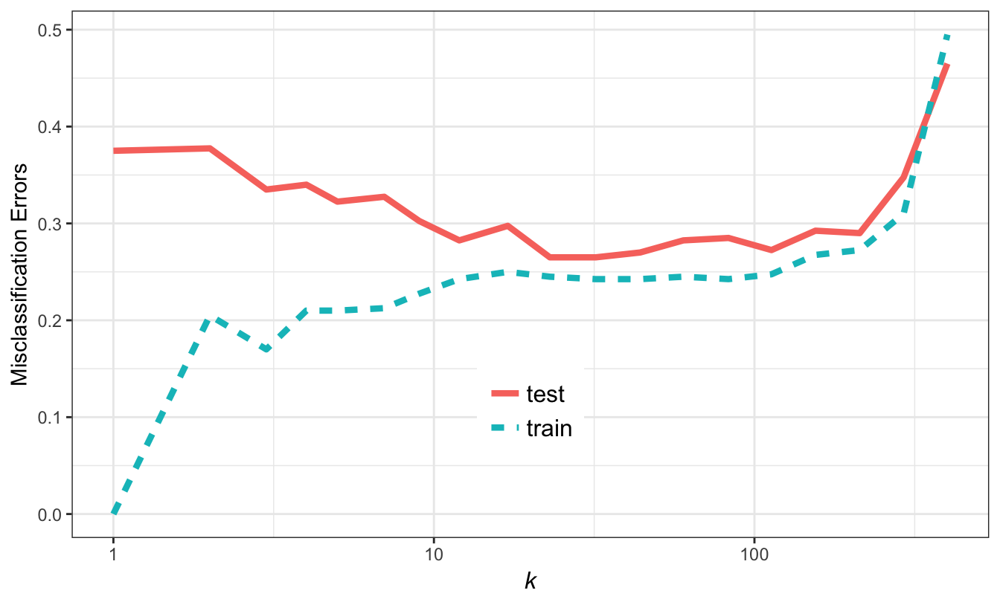

--- 
title: "An Introduction to Machine Learning"
author: "Sudhakaran Prabakaran, Matt Wayland and Chris Penfold"
date: "2018-04-30"
site: bookdown::bookdown_site
output: bookdown::gitbook
documentclass: book
bibliography: [book.bib, packages.bib]
biblio-style: apalike
link-citations: yes
github-repo: bioinformatics-training/intro-machine-learning-2018
description: "Course materials for An Introduction to Machine Learning"
cover-image: figures/cover_image.png
---

# About the course 
## Overview
## Registration
## Prerequisites
## Github
## License
## Contact
## Colophon

<!--chapter:end:index.Rmd-->


# Introduction {#intro}
## What is machine learning?
## Aspects of ML
## What actually happened under the hood

<!--chapter:end:01-intro.Rmd-->


# Linear models and matrix algebra {#linear-models}
## Linear models 
## Loading required package: MASS
## Loading required package: HistData
## Loading required package: Hmisc
## Loading required package: lattice
## Loading required package: survival
## Loading required package: Formula
## Loading required package: ggplot2
## 
## Attaching package: 'Hmisc'
## The following objects are masked from 'package:base':
## 
##     format.pval, units
## 
## Attaching package: 'UsingR'
## The following object is masked from 'package:survival':
## 
##     cancer
## Matrix algebra
##      [,1] [,2] [,3]
## [1,]    1    3    5
## [2,]    2    4    6
##      [,1] [,2] [,3]
## [1,]    1    2    3
## [2,]    4    5    6
##            [,1]       [,2]       [,3]       [,4]       [,5]
## [1,] -0.0593134 -0.2533617 -0.7074952  0.8811077 -1.1293631
## [2,]  1.1000254  0.6969634  0.3645820  0.3981059  1.4330237
## [3,]  0.7631757  0.5566632  0.7685329 -0.6120264  1.9803999
## [4,] -0.1645236 -0.6887557 -0.1123462  0.3411197 -0.3672215
##                                                             v1
## [1,] -0.0593134 -0.2533617 -0.7074952  0.8811077 -1.1293631  1
## [2,]  1.1000254  0.6969634  0.3645820  0.3981059  1.4330237  5
## [3,]  0.7631757  0.5566632  0.7685329 -0.6120264  1.9803999  7
## [4,] -0.1645236 -0.6887557 -0.1123462  0.3411197 -0.3672215  8
##                                                           v1
##    -0.0593134 -0.2533617 -0.7074952  0.8811077 -1.1293631  1
##     1.1000254  0.6969634  0.3645820  0.3981059  1.4330237  5
##     0.7631757  0.5566632  0.7685329 -0.6120264  1.9803999  7
##    -0.1645236 -0.6887557 -0.1123462  0.3411197 -0.3672215  8
## v2  1.0000000  2.0000000  3.0000000  4.0000000  5.0000000  6
## [1] 5 6
##      [,1] [,2] [,3]
## [1,]    1    3    5
## [2,]    2    4    6
##      [,1] [,2] [,3]
## [1,]    1    1    1
## [2,]    2    2    2
##      [,1] [,2] [,3]
## [1,]    2    4    6
## [2,]    4    6    8
##      [,1] [,2] [,3]
## [1,]    0    2    4
## [2,]    0    2    4
##      [,1] [,2]
## [1,]    1    3
## [2,]    2    4
##      [,1] [,2]
## [1,]   -2  1.5
## [2,]    1 -0.5
##      [,1] [,2]
## [1,]    1    2
## [2,]    1    2
## [3,]    1    2
##      [,1] [,2] [,3]
## [1,]    1    3    5
## [2,]    4    8   12
##      [,1] [,2]
## [1,]    9   18
## [2,]   12   24
## [1] "chow" "hf"
##   (Intercept) Diethf
## 1           1      0
## 2           1      0
## 3           1      0
## 4           1      0
## 5           1      0
## 6           1      0
##                  [,1]
## (Intercept) 23.813333
## Diethf       3.020833
## [1] 23.81333
## [1] 3.020833
## 
## Call:
## lm(formula = Bodyweight ~ Diet, data = dat)
## 
## Residuals:
##     Min      1Q  Median      3Q     Max 
## -6.1042 -2.4358 -0.4138  2.8335  7.1858 
## 
## Coefficients:
##             Estimate Std. Error t value Pr(>|t|)    
## (Intercept)   23.813      1.039  22.912   <2e-16 ***
## Diethf         3.021      1.470   2.055   0.0519 .  
## ---
## Signif. codes:  0 '***' 0.001 '**' 0.01 '*' 0.05 '.' 0.1 ' ' 1
## 
## Residual standard error: 3.6 on 22 degrees of freedom
## Multiple R-squared:  0.1611,	Adjusted R-squared:  0.1229 
## F-statistic: 4.224 on 1 and 22 DF,  p-value: 0.05192
## (Intercept)      Diethf 
##   23.813333    3.020833

<!--chapter:end:02-linear-models.Rmd-->


# Supervised learning  {#logistic-regression}
## Regression {#regression}
### Linear regression {#linear-regression}
## 
## Call:
## lm(formula = AT2G28890 ~ Time, data = D[25:nrow(D), ])
## 
## Coefficients:
## (Intercept)         Time  
##    10.14010     -0.04997
## Loading required package: lattice
## Loading required package: ggplot2
## 
## Call:
## lm(formula = .outcome ~ ., data = dat)
## 
## Residuals:
##      Min       1Q   Median       3Q      Max 
## -0.77349 -0.17045 -0.01839  0.15795  0.63098 
## 
## Coefficients:
##             Estimate Std. Error t value Pr(>|t|)    
## (Intercept) 10.14010    0.13975   72.56  < 2e-16 ***
## x           -0.04997    0.00489  -10.22 8.14e-10 ***
## ---
## Signif. codes:  0 '***' 0.001 '**' 0.01 '*' 0.05 '.' 0.1 ' ' 1
## 
## Residual standard error: 0.3317 on 22 degrees of freedom
## Multiple R-squared:  0.826,	Adjusted R-squared:  0.8181 
## F-statistic: 104.4 on 1 and 22 DF,  p-value: 8.136e-10
### Polynomial regression
### Distributions of fits
## Loading required package: MASS
## Loading required package: Matrix
## Loading required package: lme4
## Loading required package: methods
## 
## arm (Version 1.10-1, built: 2018-4-12)
## Working directory is /home/participant/Course_Materials
## Warning in predict.lm(lrfit4, interval = "predict"): predictions on current data refer to _future_ responses
### Gaussian process regression {#gaussian-process-regression}
#### Sampling from the prior
## Loading required package: plyr
## Loading required package: reshape2
#### Inference with GPs
#### Marginal Likelihood and Optimisation of Hyperparameters
## [1] "length-scale" "2.4"
## [1] "process variance" "1.3"
#### Model Selection {#model-selection}
#### Advanced application 1: differential expression of time series {#application-1}
#### Advanced Application 2: Timing of differential expression {#application-2}
## [1] "gene IDs are not provided. Numbers are used instead"
## rank list saved in DEtime_rank.txt
## gene IDs are not provided. Numbers are used instead.
## Testing perturbation time points are not provided. Default one is used.
## gene 1 is done
## DEtime inference is done.
## Please use print_DEtime or plot_DEtime to view the results.
## function (DEtimeOutput) 
## {
##     cat("Perturbation point inference results from DEtime package: \n")
##     cat("==========================================================\n")
##     print(DEtimeOutput$result, sep = "\t", zero.print = ".")
##     cat("==========================================================\n")
## }
## <environment: namespace:DEtime>
## All genes will be plotted 
## 1 is plotted
## ControlData is accepted
## PerturbedData is accepted
## gene IDs are not provided. Numbers are used instead.
## Testing perturbation time points are not provided. Default one is used.
## gene 1 is done
## gene 2 is done
## gene 3 is done
## gene 4 is done
## gene 5 is done
## gene 6 is done
## gene 7 is done
## gene 8 is done
## gene 9 is done
## gene 10 is done
## gene 11 is done
## gene 12 is done
## gene 13 is done
## gene 14 is done
## gene 15 is done
## gene 16 is done
## gene 17 is done
## gene 18 is done
## gene 19 is done
## gene 20 is done
## gene 21 is done
## gene 22 is done
## gene 23 is done
## gene 24 is done
## gene 25 is done
## gene 26 is done
## gene 27 is done
## gene 28 is done
## gene 29 is done
## gene 30 is done
## gene 31 is done
## gene 32 is done
## gene 33 is done
## gene 34 is done
## gene 35 is done
## gene 36 is done
## gene 37 is done
## gene 38 is done
## gene 39 is done
## gene 40 is done
## gene 41 is done
## gene 42 is done
## gene 43 is done
## gene 44 is done
## gene 45 is done
## gene 46 is done
## gene 47 is done
## gene 48 is done
## gene 49 is done
## gene 50 is done
## gene 51 is done
## gene 52 is done
## gene 53 is done
## gene 54 is done
## gene 55 is done
## gene 56 is done
## gene 57 is done
## gene 58 is done
## gene 59 is done
## gene 60 is done
## gene 61 is done
## gene 62 is done
## gene 63 is done
## gene 64 is done
## gene 65 is done
## gene 66 is done
## gene 67 is done
## gene 68 is done
## gene 69 is done
## gene 70 is done
## gene 71 is done
## gene 72 is done
## gene 73 is done
## gene 74 is done
## gene 75 is done
## gene 76 is done
## gene 77 is done
## gene 78 is done
## gene 79 is done
## gene 80 is done
## gene 81 is done
## gene 82 is done
## gene 83 is done
## gene 84 is done
## gene 85 is done
## gene 86 is done
## gene 87 is done
## gene 88 is done
## gene 89 is done
## gene 90 is done
## gene 91 is done
## gene 92 is done
## gene 93 is done
## gene 94 is done
## gene 95 is done
## gene 96 is done
## gene 97 is done
## gene 98 is done
## gene 99 is done
## gene 100 is done
## gene 101 is done
## gene 102 is done
## gene 103 is done
## gene 104 is done
## gene 105 is done
## gene 106 is done
## gene 107 is done
## gene 108 is done
## gene 109 is done
## gene 110 is done
## gene 111 is done
## gene 112 is done
## gene 113 is done
## gene 114 is done
## gene 115 is done
## gene 116 is done
## gene 117 is done
## gene 118 is done
## gene 119 is done
## gene 120 is done
## gene 121 is done
## gene 122 is done
## gene 123 is done
## gene 124 is done
## gene 125 is done
## gene 126 is done
## gene 127 is done
## gene 128 is done
## gene 129 is done
## gene 130 is done
## gene 131 is done
## gene 132 is done
## gene 133 is done
## gene 134 is done
## gene 135 is done
## gene 136 is done
## gene 137 is done
## gene 138 is done
## gene 139 is done
## gene 140 is done
## gene 141 is done
## gene 142 is done
## gene 143 is done
## gene 144 is done
## gene 145 is done
## gene 146 is done
## gene 147 is done
## gene 148 is done
## gene 149 is done
## gene 150 is done
## gene 151 is done
## gene 152 is done
## gene 153 is done
## gene 154 is done
## gene 155 is done
## gene 156 is done
## gene 157 is done
## gene 158 is done
## gene 159 is done
## gene 160 is done
## gene 161 is done
## gene 162 is done
## gene 163 is done
## gene 164 is done
## DEtime inference is done.
## Please use print_DEtime or plot_DEtime to view the results.
#### Scalability
## Classification {#classification}
### Logistic regression {#logistic-regression}
## Type 'citation("pROC")' for a citation.
## 
## Attaching package: 'pROC'
## The following objects are masked from 'package:stats':
## 
##     cov, smooth, var
## Loading required package: gplots
## 
## Attaching package: 'gplots'
## The following object is masked from 'package:stats':
## 
##     lowess
## [1] 0.6111111
##  [1] "AT1G29990" "AT1G67170" "AT2G21380" "AT2G28890" "AT2G35500"
##  [6] "AT2G45660" "AT3G09980" "AT3G11590" "AT3G13720" "AT3G25710"
## [11] "AT3G44720" "AT3G48150" "AT4G00710" "AT4G02150" "AT4G16380"
## [16] "AT4G19700" "AT4G26450" "AT4G28640" "AT4G34710" "AT4G36970"
## [21] "AT4G39050" "AT5G11980" "AT5G22630" "AT5G24660" "AT5G43700"
## [26] "AT5G50010" "AT5G56250"
### GP classification {#gp-classification}
## 
## Attaching package: 'kernlab'
## The following object is masked from 'package:ggplot2':
## 
##     alpha
## Using automatic sigma estimation (sigest) for RBF or laplace kernel 
## Using automatic sigma estimation (sigest) for RBF or laplace kernel 
## Using automatic sigma estimation (sigest) for RBF or laplace kernel 
## Using automatic sigma estimation (sigest) for RBF or laplace kernel 
## Using automatic sigma estimation (sigest) for RBF or laplace kernel 
## Using automatic sigma estimation (sigest) for RBF or laplace kernel 
## Using automatic sigma estimation (sigest) for RBF or laplace kernel 
## Using automatic sigma estimation (sigest) for RBF or laplace kernel 
## Using automatic sigma estimation (sigest) for RBF or laplace kernel 
## Using automatic sigma estimation (sigest) for RBF or laplace kernel 
## Using automatic sigma estimation (sigest) for RBF or laplace kernel 
## Using automatic sigma estimation (sigest) for RBF or laplace kernel 
## Using automatic sigma estimation (sigest) for RBF or laplace kernel 
## Using automatic sigma estimation (sigest) for RBF or laplace kernel 
## Using automatic sigma estimation (sigest) for RBF or laplace kernel 
## Using automatic sigma estimation (sigest) for RBF or laplace kernel 
## Using automatic sigma estimation (sigest) for RBF or laplace kernel 
## Using automatic sigma estimation (sigest) for RBF or laplace kernel 
## Using automatic sigma estimation (sigest) for RBF or laplace kernel 
## Using automatic sigma estimation (sigest) for RBF or laplace kernel 
## Using automatic sigma estimation (sigest) for RBF or laplace kernel 
## Using automatic sigma estimation (sigest) for RBF or laplace kernel 
## Using automatic sigma estimation (sigest) for RBF or laplace kernel 
## Using automatic sigma estimation (sigest) for RBF or laplace kernel 
## Using automatic sigma estimation (sigest) for RBF or laplace kernel 
## Using automatic sigma estimation (sigest) for RBF or laplace kernel 
## Using automatic sigma estimation (sigest) for RBF or laplace kernel 
## Using automatic sigma estimation (sigest) for RBF or laplace kernel 
## Using automatic sigma estimation (sigest) for RBF or laplace kernel 
## Using automatic sigma estimation (sigest) for RBF or laplace kernel 
## Using automatic sigma estimation (sigest) for RBF or laplace kernel 
## Using automatic sigma estimation (sigest) for RBF or laplace kernel 
## Using automatic sigma estimation (sigest) for RBF or laplace kernel 
## Using automatic sigma estimation (sigest) for RBF or laplace kernel 
## Using automatic sigma estimation (sigest) for RBF or laplace kernel 
## Using automatic sigma estimation (sigest) for RBF or laplace kernel 
## Using automatic sigma estimation (sigest) for RBF or laplace kernel 
## Using automatic sigma estimation (sigest) for RBF or laplace kernel 
## Using automatic sigma estimation (sigest) for RBF or laplace kernel 
## Using automatic sigma estimation (sigest) for RBF or laplace kernel 
## Using automatic sigma estimation (sigest) for RBF or laplace kernel 
## Using automatic sigma estimation (sigest) for RBF or laplace kernel 
## Using automatic sigma estimation (sigest) for RBF or laplace kernel 
## Using automatic sigma estimation (sigest) for RBF or laplace kernel 
## Using automatic sigma estimation (sigest) for RBF or laplace kernel 
## Using automatic sigma estimation (sigest) for RBF or laplace kernel 
## Using automatic sigma estimation (sigest) for RBF or laplace kernel 
## Using automatic sigma estimation (sigest) for RBF or laplace kernel 
## Using automatic sigma estimation (sigest) for RBF or laplace kernel 
## Using automatic sigma estimation (sigest) for RBF or laplace kernel 
## Using automatic sigma estimation (sigest) for RBF or laplace kernel 
## Using automatic sigma estimation (sigest) for RBF or laplace kernel 
## Using automatic sigma estimation (sigest) for RBF or laplace kernel 
## Using automatic sigma estimation (sigest) for RBF or laplace kernel 
## Using automatic sigma estimation (sigest) for RBF or laplace kernel 
## Using automatic sigma estimation (sigest) for RBF or laplace kernel 
## Using automatic sigma estimation (sigest) for RBF or laplace kernel 
## Using automatic sigma estimation (sigest) for RBF or laplace kernel 
## Using automatic sigma estimation (sigest) for RBF or laplace kernel 
## Using automatic sigma estimation (sigest) for RBF or laplace kernel 
## Using automatic sigma estimation (sigest) for RBF or laplace kernel 
## Using automatic sigma estimation (sigest) for RBF or laplace kernel 
## Using automatic sigma estimation (sigest) for RBF or laplace kernel 
## Using automatic sigma estimation (sigest) for RBF or laplace kernel 
## Using automatic sigma estimation (sigest) for RBF or laplace kernel 
## Using automatic sigma estimation (sigest) for RBF or laplace kernel 
## Using automatic sigma estimation (sigest) for RBF or laplace kernel 
## Using automatic sigma estimation (sigest) for RBF or laplace kernel 
## Using automatic sigma estimation (sigest) for RBF or laplace kernel 
## Using automatic sigma estimation (sigest) for RBF or laplace kernel 
## Using automatic sigma estimation (sigest) for RBF or laplace kernel 
## Using automatic sigma estimation (sigest) for RBF or laplace kernel 
## Using automatic sigma estimation (sigest) for RBF or laplace kernel 
## Using automatic sigma estimation (sigest) for RBF or laplace kernel 
## Using automatic sigma estimation (sigest) for RBF or laplace kernel 
## Using automatic sigma estimation (sigest) for RBF or laplace kernel 
## Using automatic sigma estimation (sigest) for RBF or laplace kernel 
## Using automatic sigma estimation (sigest) for RBF or laplace kernel 
## Using automatic sigma estimation (sigest) for RBF or laplace kernel 
## Using automatic sigma estimation (sigest) for RBF or laplace kernel 
## Using automatic sigma estimation (sigest) for RBF or laplace kernel 
## Using automatic sigma estimation (sigest) for RBF or laplace kernel 
## Using automatic sigma estimation (sigest) for RBF or laplace kernel 
## Using automatic sigma estimation (sigest) for RBF or laplace kernel 
## Using automatic sigma estimation (sigest) for RBF or laplace kernel 
## Using automatic sigma estimation (sigest) for RBF or laplace kernel 
## Using automatic sigma estimation (sigest) for RBF or laplace kernel 
## Using automatic sigma estimation (sigest) for RBF or laplace kernel 
## Using automatic sigma estimation (sigest) for RBF or laplace kernel 
## Using automatic sigma estimation (sigest) for RBF or laplace kernel 
## Using automatic sigma estimation (sigest) for RBF or laplace kernel 
## Using automatic sigma estimation (sigest) for RBF or laplace kernel 
## Using automatic sigma estimation (sigest) for RBF or laplace kernel 
## Using automatic sigma estimation (sigest) for RBF or laplace kernel 
## Using automatic sigma estimation (sigest) for RBF or laplace kernel 
## Using automatic sigma estimation (sigest) for RBF or laplace kernel 
## Using automatic sigma estimation (sigest) for RBF or laplace kernel 
## Using automatic sigma estimation (sigest) for RBF or laplace kernel 
## Using automatic sigma estimation (sigest) for RBF or laplace kernel 
## Using automatic sigma estimation (sigest) for RBF or laplace kernel 
## Using automatic sigma estimation (sigest) for RBF or laplace kernel 
## Using automatic sigma estimation (sigest) for RBF or laplace kernel 
## Using automatic sigma estimation (sigest) for RBF or laplace kernel 
## Using automatic sigma estimation (sigest) for RBF or laplace kernel 
## Using automatic sigma estimation (sigest) for RBF or laplace kernel 
## Using automatic sigma estimation (sigest) for RBF or laplace kernel 
## Using automatic sigma estimation (sigest) for RBF or laplace kernel 
## Using automatic sigma estimation (sigest) for RBF or laplace kernel 
## Using automatic sigma estimation (sigest) for RBF or laplace kernel 
## Using automatic sigma estimation (sigest) for RBF or laplace kernel 
## Using automatic sigma estimation (sigest) for RBF or laplace kernel 
## Using automatic sigma estimation (sigest) for RBF or laplace kernel 
## Using automatic sigma estimation (sigest) for RBF or laplace kernel 
## Using automatic sigma estimation (sigest) for RBF or laplace kernel 
## Using automatic sigma estimation (sigest) for RBF or laplace kernel 
## Using automatic sigma estimation (sigest) for RBF or laplace kernel 
## Using automatic sigma estimation (sigest) for RBF or laplace kernel 
## Using automatic sigma estimation (sigest) for RBF or laplace kernel 
## Using automatic sigma estimation (sigest) for RBF or laplace kernel 
## Using automatic sigma estimation (sigest) for RBF or laplace kernel 
## Using automatic sigma estimation (sigest) for RBF or laplace kernel 
## Using automatic sigma estimation (sigest) for RBF or laplace kernel 
## Using automatic sigma estimation (sigest) for RBF or laplace kernel 
## Using automatic sigma estimation (sigest) for RBF or laplace kernel 
## Using automatic sigma estimation (sigest) for RBF or laplace kernel 
## Using automatic sigma estimation (sigest) for RBF or laplace kernel 
## Using automatic sigma estimation (sigest) for RBF or laplace kernel 
## Using automatic sigma estimation (sigest) for RBF or laplace kernel 
## Using automatic sigma estimation (sigest) for RBF or laplace kernel 
## Using automatic sigma estimation (sigest) for RBF or laplace kernel 
## Using automatic sigma estimation (sigest) for RBF or laplace kernel 
## Using automatic sigma estimation (sigest) for RBF or laplace kernel 
## Using automatic sigma estimation (sigest) for RBF or laplace kernel 
## Using automatic sigma estimation (sigest) for RBF or laplace kernel 
## Using automatic sigma estimation (sigest) for RBF or laplace kernel 
## Using automatic sigma estimation (sigest) for RBF or laplace kernel 
## Using automatic sigma estimation (sigest) for RBF or laplace kernel 
## Using automatic sigma estimation (sigest) for RBF or laplace kernel 
## Using automatic sigma estimation (sigest) for RBF or laplace kernel 
## Using automatic sigma estimation (sigest) for RBF or laplace kernel 
## Using automatic sigma estimation (sigest) for RBF or laplace kernel 
## Using automatic sigma estimation (sigest) for RBF or laplace kernel 
## Using automatic sigma estimation (sigest) for RBF or laplace kernel 
## Using automatic sigma estimation (sigest) for RBF or laplace kernel 
## Using automatic sigma estimation (sigest) for RBF or laplace kernel 
## Using automatic sigma estimation (sigest) for RBF or laplace kernel 
## Using automatic sigma estimation (sigest) for RBF or laplace kernel 
## Using automatic sigma estimation (sigest) for RBF or laplace kernel 
## Using automatic sigma estimation (sigest) for RBF or laplace kernel 
## Using automatic sigma estimation (sigest) for RBF or laplace kernel 
## Using automatic sigma estimation (sigest) for RBF or laplace kernel 
## Using automatic sigma estimation (sigest) for RBF or laplace kernel 
## Using automatic sigma estimation (sigest) for RBF or laplace kernel 
## Using automatic sigma estimation (sigest) for RBF or laplace kernel 
## Using automatic sigma estimation (sigest) for RBF or laplace kernel 
## Using automatic sigma estimation (sigest) for RBF or laplace kernel 
## Using automatic sigma estimation (sigest) for RBF or laplace kernel 
## Using automatic sigma estimation (sigest) for RBF or laplace kernel 
## Using automatic sigma estimation (sigest) for RBF or laplace kernel 
## Using automatic sigma estimation (sigest) for RBF or laplace kernel 
## Using automatic sigma estimation (sigest) for RBF or laplace kernel 
## Using automatic sigma estimation (sigest) for RBF or laplace kernel
## [1] 0.8660466
## [1] 0.7104377
## Using automatic sigma estimation (sigest) for RBF or laplace kernel
## [1] 0.8193042
### Other classification approaches.
## Loading required package: grid
## Loading required package: mvtnorm
## Loading required package: modeltools
## Loading required package: stats4
## 
## Attaching package: 'modeltools'
## The following object is masked from 'package:kernlab':
## 
##     prior
## The following object is masked from 'package:plyr':
## 
##     empty
## The following object is masked from 'package:lme4':
## 
##     refit
## Loading required package: strucchange
## Loading required package: zoo
## 
## Attaching package: 'zoo'
## The following objects are masked from 'package:base':
## 
##     as.Date, as.Date.numeric
## Loading required package: sandwich
## 
## Convergence warning in plr: 6
## Resources
## Exercises

<!--chapter:end:03-logistic-regression.Rmd-->


# Dimensionality reduction {#dimensionality-reduction}
## Linear Dimensionality Reduction {#linear-dimensionality-reduction}
### Interpreting the Principle Component Axes
### Horseshoe effect
### PCA analysis of mammalian development
## Nonlinear Dimensionality Reduction {#nonlinear-dimensionality-reduction}
### Nonlinear warping 
### Stochasticity
### Analysis of mammalian development
## Other dimensionality reduction techniques

<!--chapter:end:04-dimensionality-reduction.Rmd-->


# Clustering {#clustering}
## Introduction
## Distance metrics
## Hierarchic agglomerative
### Linkage algorithms
### Example: clustering synthetic data sets
#### Step-by-step instructions
## 
## ---------------------
## Welcome to dendextend version 1.7.0
## Type citation('dendextend') for how to cite the package.
## 
## Type browseVignettes(package = 'dendextend') for the package vignette.
## The github page is: https://github.com/talgalili/dendextend/
## 
## Suggestions and bug-reports can be submitted at: https://github.com/talgalili/dendextend/issues
## Or contact: <tal.galili@gmail.com>
## 
## 	To suppress this message use:  suppressPackageStartupMessages(library(dendextend))
## ---------------------
## 
## Attaching package: 'dendextend'
## The following object is masked from 'package:ggdendro':
## 
##     theme_dendro
## The following object is masked from 'package:stats':
## 
##     cutree
#### Clustering of other synthetic data sets
### Example: gene expression profiling of human tissues
#### Basics
## tissue
##  cerebellum       colon endometrium hippocampus      kidney       liver 
##          38          34          15          31          39          26 
##    placenta 
##           6
## [1] 22215   189
#### Colour labels
#### Defining clusters by cutting tree
##              cluster
## tissue         1  2  3  4  5  6
##   cerebellum   0 36  0  0  2  0
##   colon        0  0 34  0  0  0
##   endometrium 15  0  0  0  0  0
##   hippocampus  0 31  0  0  0  0
##   kidney      37  0  0  0  2  0
##   liver        0  0  0 24  2  0
##   placenta     0  0  0  0  0  6
##              cluster
## tissue         1  2  3  4  5  6  7  8
##   cerebellum   0 31  0  0  2  0  5  0
##   colon        0  0 34  0  0  0  0  0
##   endometrium  0  0  0  0  0 15  0  0
##   hippocampus  0 31  0  0  0  0  0  0
##   kidney      37  0  0  0  2  0  0  0
##   liver        0  0  0 24  2  0  0  0
##   placenta     0  0  0  0  0  0  0  6
#### Heatmap
## 
## Attaching package: 'gplots'
## The following object is masked from 'package:stats':
## 
##     lowess
## K-means
### Algorithm
### Choosing initial cluster centres
### Choosing k {#choosingK}
### Example: clustering synthetic data sets
#### Aggregation
#### Noisy moons
#### Different density
## Warning: did not converge in 10 iterations
## Warning: did not converge in 10 iterations
## Warning: did not converge in 10 iterations
#### Anisotropic distributions
#### No structure
### Example: gene expression profiling of human tissues
## tissue
##  cerebellum       colon endometrium hippocampus      kidney       liver 
##          38          34          15          31          39          26 
##    placenta 
##           6
## [1] 22215   189
## Loading required package: foreach
## Loading required package: iterators
## Loading required package: parallel
## [1] 4
##              
## tissue         1  2  3  4  5  6  7
##   cerebellum   0  0  0 33  0  0  5
##   colon        0  0  0  0  0 34  0
##   endometrium  0  0  0  0 15  0  0
##   hippocampus  0  0  0  0  0  0 31
##   kidney       0  0 39  0  0  0  0
##   liver       26  0  0  0  0  0  0
##   placenta     0  6  0  0  0  0  0
##              
## tissue         1  2  3  4  5  6  7
##   cerebellum   0  0  5 31  0  0  2
##   colon        0 34  0  0  0  0  0
##   endometrium 15  0  0  0  0  0  0
##   hippocampus  0  0 31  0  0  0  0
##   kidney      37  0  0  0  0  0  2
##   liver        0  0  0  0  0 24  2
##   placenta     0  0  0  0  6  0  0
## DBSCAN
### Algorithm
### Implementation in R
### Choosing parameters
## 
##   0   1   2   3 
##  43 484 486 487
### Example: clustering synthetic data sets
#### Aggregation
## 
##   0   1   2   3   4   5   6 
##   2 168 307 105 127  45  34
#### Noisy moons
## 
##   0   1   2 
##   8 748 744
#### Different density
## 
##    0    1 
##   40 1460
## 
##   0   1   2 
## 109 399 992
#### Anisotropic distributions
## 
##   0   1   2   3 
##  29 489 488 494
#### No structure
## 
##    1 
## 1500
### Example: gene expression profiling of human tissues
## tissue
##  cerebellum       colon endometrium hippocampus      kidney       liver 
##          38          34          15          31          39          26 
##    placenta 
##           6
## 
##  0  1  2  3  4  5  6 
## 12 37 62 34 24 15  5
##              
## tissue         0  1  2  3  4  5  6
##   cerebellum   2  0 31  0  0  0  5
##   colon        0  0  0 34  0  0  0
##   endometrium  0  0  0  0  0 15  0
##   hippocampus  0  0 31  0  0  0  0
##   kidney       2 37  0  0  0  0  0
##   liver        2  0  0  0 24  0  0
##   placenta     6  0  0  0  0  0  0
## Evaluating cluster quality
### Silhouette method {#silhouetteMethod}
### Example - k-means clustering of blobs data set
### Example - DBSCAN clustering of noisy moons
## Exercises
### Exercise 1 {#clusteringEx1}
## 
## Attaching package: 'EBImage'
## The following object is masked from 'package:dendextend':
## 
##     rotate
## [1] 528 393   3

<!--chapter:end:05-clustering.Rmd-->

---
output: html_document
editor_options: 
  chunk_output_type: console
---
# Nearest neighbours {#nearest-neighbours}

<!-- Matt -->

## Introduction
_k_-NN is by far the simplest method of supervised learning we will cover in this course. It is a non-parametric method that can be used for both classification (predicting class membership) and regression (estimating continuous variables). _k_-NN is categorized as instance based (memory based) learning, because all computation is deferred until classification. The most computationally demanding aspects of _k_-NN are finding neighbours and storing the entire learning set.

A simple _k_-NN classification rule (figure \@ref(fig:knnClassification)) would proceed as follows:

1. when presented with a new observation, find the _k_ closest samples in the learning set
2. predict the class by majority vote

<div class="figure" style="text-align: center">

<p class="caption">(\#fig:knnClassification)Illustration of _k_-nn classification. In this example we have two classes: blue squares and red triangles. The green circle represents a test object. If k=3 (solid line circle) the test object is assigned to the red triangle class. If k=5 the test object is assigned to the blue square class.  By Antti Ajanki AnAj - Own work, CC BY-SA 3.0, https://commons.wikimedia.org/w/index.php?curid=2170282</p>
</div>

A basic implementation of _k_-NN regression would calculate the average of the numerical outcome of the _k_ nearest neighbours. 

The number of neighbours _k_ can have a considerable impact on the predictive performance of _k_-NN in both classification and regression. The optimal value of _k_ should be chosen using cross-validation.

Euclidean distance is the most widely used distance metric in _k_-nn, and will be used in the examples and exercises in this chapter. However, other distance metrics can be used.

**Euclidean distance:**
\begin{equation}
  distance\left(p,q\right)=\sqrt{\sum_{i=1}^{n} (p_i-q_i)^2}
  (\#eq:euclidean)
\end{equation}


<div class="figure" style="text-align: center">

<p class="caption">(\#fig:euclideanDistanceDiagram)Euclidean distance.</p>
</div>


## Classification: simulated data

A simulated data set will be used to demonstrate:

* bias-variance trade-off
* the knn function in R
* plotting decision boundaries
* choosing the optimum value of _k_

The dataset has been partitioned into training and test sets.

Load data

```r
load("data/example_binary_classification/bin_class_example.rda")
str(xtrain)
```

```
## 'data.frame':	400 obs. of  2 variables:
##  $ V1: num  -0.223 0.944 2.36 1.846 1.732 ...
##  $ V2: num  -1.153 -0.827 -0.128 2.014 -0.574 ...
```

```r
str(xtest)
```

```
## 'data.frame':	400 obs. of  2 variables:
##  $ V1: num  2.09 2.3 2.07 1.65 1.18 ...
##  $ V2: num  -1.009 1.0947 0.1644 0.3243 -0.0277 ...
```

```r
summary(as.factor(ytrain))
```

```
##   0   1 
## 200 200
```

```r
summary(as.factor(ytest))
```

```
##   0   1 
## 200 200
```


```r
library(ggplot2)
library(GGally)
library(RColorBrewer)
point_shapes <- c(15,17)
point_colours <- brewer.pal(3,"Dark2")
point_size = 2

ggplot(xtrain, aes(V1,V2)) + 
  geom_point(col=point_colours[ytrain+1], shape=point_shapes[ytrain+1], 
             size=point_size) + 
  ggtitle("train") +
  theme_bw() +
  theme(plot.title = element_text(size=25, face="bold"), axis.text=element_text(size=15),
        axis.title=element_text(size=20,face="bold"))

ggplot(xtest, aes(V1,V2)) + 
  geom_point(col=point_colours[ytest+1], shape=point_shapes[ytest+1], 
             size=point_size) + 
  ggtitle("test") +
  theme_bw() +
  theme(plot.title = element_text(size=25, face="bold"), axis.text=element_text(size=15),
        axis.title=element_text(size=20,face="bold"))
```

<div class="figure" style="text-align: center">

<p class="caption">(\#fig:simDataBinClassTrainTest)Scatterplots of the simulated training and test data sets that will be used in the demonstration of binary classification using _k_-nn</p>
</div>


### knn function
For _k_-nn classification and regression we will use the **knn** function in the package **class**.

```r
library(class)
```

**Arguments to knn**

* ```train``` : matrix or data frame of training set cases.
* ```test``` : matrix or data frame of test set cases. A vector will be interpreted as a row vector for a single case.
* ```cl``` : factor of true classifications of training set
* ```k``` : number of neighbours considered.
* ```l``` : minimum vote for definite decision, otherwise doubt. (More precisely, less than k-l dissenting votes are allowed, even if k is increased by ties.)
* ```prob``` : If this is true, the proportion of the votes for the winning class are returned as attribute prob.
* ```use.all``` : controls handling of ties. If true, all distances equal to the kth largest are included. If false, a random selection of distances equal to the kth is chosen to use exactly k neighbours.

Let us perform _k_-nn on the training set with _k_=1. We will use the **confusionMatrix** function from the [caret](http://cran.r-project.org/web/packages/caret/index.html) package to summarize performance of the classifier.

```r
library(caret)
```

```
## Loading required package: lattice
```

```r
knn1train <- class::knn(train=xtrain, test=xtrain, cl=ytrain, k=1)
confusionMatrix(knn1train, as.factor(ytrain))
```

```
## Confusion Matrix and Statistics
## 
##           Reference
## Prediction   0   1
##          0 200   0
##          1   0 200
##                                      
##                Accuracy : 1          
##                  95% CI : (0.9908, 1)
##     No Information Rate : 0.5        
##     P-Value [Acc > NIR] : < 2.2e-16  
##                                      
##                   Kappa : 1          
##  Mcnemar's Test P-Value : NA         
##                                      
##             Sensitivity : 1.0        
##             Specificity : 1.0        
##          Pos Pred Value : 1.0        
##          Neg Pred Value : 1.0        
##              Prevalence : 0.5        
##          Detection Rate : 0.5        
##    Detection Prevalence : 0.5        
##       Balanced Accuracy : 1.0        
##                                      
##        'Positive' Class : 0          
## 
```
The classifier performs perfectly on the training set, because with _k_=1, each observation is being predicted by itself!
<!--
table(ytrain,knn1train)
cat("KNN prediction error for training set: ", 1-mean(as.numeric(as.vector(knn1train))==ytrain), "\n")
-->

Now let use the training set to predict on the test set.

```r
knn1test <- class::knn(train=xtrain, test=xtest, cl=ytrain, k=1)
confusionMatrix(knn1test, as.factor(ytest))
```

```
## Confusion Matrix and Statistics
## 
##           Reference
## Prediction   0   1
##          0 131  81
##          1  69 119
##                                           
##                Accuracy : 0.625           
##                  95% CI : (0.5755, 0.6726)
##     No Information Rate : 0.5             
##     P-Value [Acc > NIR] : 3.266e-07       
##                                           
##                   Kappa : 0.25            
##  Mcnemar's Test P-Value : 0.3691          
##                                           
##             Sensitivity : 0.6550          
##             Specificity : 0.5950          
##          Pos Pred Value : 0.6179          
##          Neg Pred Value : 0.6330          
##              Prevalence : 0.5000          
##          Detection Rate : 0.3275          
##    Detection Prevalence : 0.5300          
##       Balanced Accuracy : 0.6250          
##                                           
##        'Positive' Class : 0               
## 
```
Performance on the test set is not so good. This is an example of a classifier being over-fitted to the training set. 
<!--
table(ytest, knn1test)
cat("KNN prediction error for test set: ", 1-mean(as.numeric(as.vector(knn1test))==ytest), "\n")
-->

### Plotting decision boundaries
Since we have just two dimensions we can visualize the decision boundary generated by the _k_-nn classifier in a 2D scatterplot. Situations where your original data set contains only two variables will be rare, but it is not unusual to reduce a high-dimensional data set to just two dimensions using the methods that will be discussed in chapter \@ref(dimensionality-reduction). Therefore, knowing how to plot decision boundaries will potentially be helpful for many different datasets and classifiers.

Create a grid so we can predict across the full range of our variables V1 and V2.

```r
gridSize <- 150 
v1limits <- c(min(c(xtrain[,1],xtest[,1])),max(c(xtrain[,1],xtest[,1])))
tmpV1 <- seq(v1limits[1],v1limits[2],len=gridSize)
v2limits <- c(min(c(xtrain[,2],xtest[,2])),max(c(xtrain[,2],xtest[,2])))
tmpV2 <- seq(v2limits[1],v2limits[2],len=gridSize)
xgrid <- expand.grid(tmpV1,tmpV2)
names(xgrid) <- names(xtrain)
```

Predict values of all elements of grid.

```r
knn1grid <- class::knn(train=xtrain, test=xgrid, cl=ytrain, k=1)
V3 <- as.numeric(as.vector(knn1grid))
xgrid <- cbind(xgrid, V3)
```

Plot

```r
point_shapes <- c(15,17)
point_colours <- brewer.pal(3,"Dark2")
point_size = 2

ggplot(xgrid, aes(V1,V2)) +
  geom_point(col=point_colours[knn1grid], shape=16, size=0.3) +
  geom_point(data=xtrain, aes(V1,V2), col=point_colours[ytrain+1],
             shape=point_shapes[ytrain+1], size=point_size) +
  geom_contour(data=xgrid, aes(x=V1, y=V2, z=V3), breaks=0.5, col="grey30") +
  ggtitle("train") +
  theme_bw() +
  theme(plot.title = element_text(size=25, face="bold"), axis.text=element_text(size=15),
        axis.title=element_text(size=20,face="bold"))

ggplot(xgrid, aes(V1,V2)) +
  geom_point(col=point_colours[knn1grid], shape=16, size=0.3) +
  geom_point(data=xtest, aes(V1,V2), col=point_colours[ytest+1],
             shape=point_shapes[ytrain+1], size=point_size) +
  geom_contour(data=xgrid, aes(x=V1, y=V2, z=V3), breaks=0.5, col="grey30") +
  ggtitle("test") +
  theme_bw() +
  theme(plot.title = element_text(size=25, face="bold"), axis.text=element_text(size=15),
        axis.title=element_text(size=20,face="bold"))
```

<div class="figure" style="text-align: center">

<p class="caption">(\#fig:simDataBinClassDecisionBoundaryK1)Binary classification of the simulated training and test sets with _k_=1.</p>
</div>

### Bias-variance tradeoff
The bias–variance tradeoff is the problem of simultaneously minimizing two sources of error that prevent supervised learning algorithms from generalizing beyond their training set:

* The bias is error from erroneous assumptions in the learning algorithm. High bias can cause an algorithm to miss the relevant relations between features and target outputs (underfitting).
* The variance is error from sensitivity to small fluctuations in the training set. High variance can cause an algorithm to model the random noise in the training data, rather than the intended outputs (overfitting).

To demonstrate this phenomenon, let us look at the performance of the _k_-nn classifier over a range of values of _k_.  First we will define a function to create a sequence of log spaced values. This is the **lseq** function from the [emdbook](https://cran.r-project.org/package=emdbook) package:

```r
lseq <- function(from, to, length.out) {
  exp(seq(log(from), log(to), length.out = length.out))
}
```

Get log spaced sequence of length 20, round and then remove any duplicates resulting from rounding.

```r
s <- unique(round(lseq(1,400,20)))
length(s)
```

```
## [1] 19
```


```r
train_error <- sapply(s, function(i){
  yhat <- knn(xtrain, xtrain, ytrain, i)
  return(1-mean(as.numeric(as.vector(yhat))==ytrain))
})

test_error <- sapply(s, function(i){
  yhat <- knn(xtrain, xtest, ytrain, i)
  return(1-mean(as.numeric(as.vector(yhat))==ytest))
})

k <- rep(s, 2)
set <- c(rep("train", length(s)), rep("test", length(s)))
error <- c(train_error, test_error)
misclass_errors <- data.frame(k, set, error)
```


```r
ggplot(misclass_errors, aes(x=k, y=error, group=set)) + 
  geom_line(aes(colour=set, linetype=set), size=1.5) +
  scale_x_log10() +
  ylab("Misclassification Errors") +
  theme_bw() +
  theme(legend.position = c(0.5, 0.25), legend.title=element_blank(),
        legend.text=element_text(size=12), 
        axis.title.x=element_text(face="italic", size=12))
```

<div class="figure" style="text-align: center">

<p class="caption">(\#fig:misclassErrorsFunK)Misclassification errors as a function of neighbourhood size.</p>
</div>
We see excessive variance (overfitting) at low values of _k_, and bias (underfitting) at high values of _k_.

### Choosing _k_

We will use the caret library. Caret provides a unified interface to a huge range of supervised learning packages in R. The design of its tools encourages best practice, especially in relation to cross-validation and testing. Additionally, it has automatic parallel processing built in, which is a significant advantage when dealing with large data sets.

```r
library(caret)
```

To take advantage of Caret's parallel processing functionality, we simply need to load the [doMC](http://cran.r-project.org/web/packages/doMC/index.html) package and register workers: 

```r
library(doMC)
```

```
## Loading required package: foreach
```

```
## Loading required package: iterators
```

```
## Loading required package: parallel
```

```r
registerDoMC()
```

To find out how many cores we have registered we can use:

```r
getDoParWorkers()
```

```
## [1] 2
```

The [caret](http://cran.r-project.org/web/packages/caret/index.html) function **train** is used to fit predictive models over different values of _k_. The function **trainControl** is used to specify a list of computational and resampling options, which will be passed to **train**. We will start by configuring our cross-validation procedure using **trainControl**.

We would like to make this demonstration reproducible and because we will be running the models in parallel, using the **set.seed** function alone is not sufficient. In addition to using **set.seed** we have to make use of the optional **seeds** argument to **trainControl**. We need to supply **seeds** with a list of integers that will be used to set the seed at each sampling iteration. The list is required to have a length of B+1, where B is the number of resamples. We will be repeating 10-fold cross-validation a total of ten times and so our list must have a length of 101. The first B elements of the list are required to be vectors of integers of length M, where M is the number of models being evaluated (in this case 19). The last element of the list only needs to be a single integer, which will be used for the final model.

First we generate our list of seeds.

```r
set.seed(42)
seeds <- vector(mode = "list", length = 101)
for(i in 1:100) seeds[[i]] <- sample.int(1000, 19)
seeds[[101]] <- sample.int(1000,1)
```

We can now use **trainControl** to create a list of computational options for resampling.

```r
tc <- trainControl(method="repeatedcv",
                   number = 10,
                   repeats = 10,
                   seeds = seeds)
```

There are two options for choosing the values of _k_ to be evaluated by the **train** function:

1. Pass a data.frame of values of _k_ to the **tuneGrid** argument of **train**.
2. Specify the number of different levels of _k_ using the **tuneLength** function and allow **train** to pick the actual values.

We will use the first option, so that we can try the values of _k_ we examined earlier. The vector of values of _k_ we created earlier should be converted into a data.frame.


```r
s <- data.frame(s)
names(s) <- "k"
```

We are now ready to run the cross-validation.

```r
knnFit <- train(xtrain, as.factor(ytrain), 
                method="knn",
                tuneGrid=s,
                trControl=tc)

knnFit
```

```
## k-Nearest Neighbors 
## 
## 400 samples
##   2 predictor
##   2 classes: '0', '1' 
## 
## No pre-processing
## Resampling: Cross-Validated (10 fold, repeated 10 times) 
## Summary of sample sizes: 360, 360, 360, 360, 360, 360, ... 
## Resampling results across tuning parameters:
## 
##   k    Accuracy  Kappa 
##     1  0.63300   0.2660
##     2  0.63875   0.2775
##     3  0.67375   0.3475
##     4  0.67900   0.3580
##     5  0.69575   0.3915
##     7  0.71100   0.4220
##     9  0.71775   0.4355
##    12  0.71500   0.4300
##    17  0.72675   0.4535
##    23  0.73800   0.4760
##    32  0.73725   0.4745
##    44  0.73875   0.4775
##    60  0.74850   0.4970
##    83  0.75500   0.5100
##   113  0.73500   0.4700
##   155  0.72575   0.4515
##   213  0.70750   0.4150
##   292  0.68825   0.3765
##   400  0.51300   0.0260
## 
## Accuracy was used to select the optimal model using  the largest value.
## The final value used for the model was k = 83.
```

**Cohen's Kappa:**
\begin{equation}
  Kappa = \frac{O-E}{1-E}
  (\#eq:kappa)
\end{equation}

where _O_ is the observed accuracy and _E_ is the expected accuracy based on the marginal totals of the confusion matrix. Cohen's Kappa takes values between -1 and 1; a value of zero indicates no agreement between the observed and predicted classes, while a value of one shows perfect concordance of the model prediction and the observed classes. If the prediction is in the opposite direction of the truth, a negative value will be obtained, but large negative values are rare in practice [@Kuhn2013].

We can plot accuracy (determined from repeated cross-validation) as a function of neighbourhood size.

```r
plot(knnFit)
```

<div class="figure" style="text-align: center">

<p class="caption">(\#fig:cvAccuracyFunK)Accuracy (repeated cross-validation) as a function of neighbourhood size.</p>
</div>

We can also plot other performance metrics, such as Cohen's Kappa, using the **metric** argument.

```r
plot(knnFit, metric="Kappa")
```

<div class="figure" style="text-align: center">

<p class="caption">(\#fig:cvKappaFunK)Cohen's Kappa (repeated cross-validation) as a function of neighbourhood size.</p>
</div>

Let us now evaluate how our classifier performs on the test set.

```r
test_pred <- predict(knnFit, xtest)
confusionMatrix(test_pred, as.factor(ytest))
```

```
## Confusion Matrix and Statistics
## 
##           Reference
## Prediction   0   1
##          0 154  68
##          1  46 132
##                                          
##                Accuracy : 0.715          
##                  95% CI : (0.668, 0.7588)
##     No Information Rate : 0.5            
##     P-Value [Acc > NIR] : <2e-16         
##                                          
##                   Kappa : 0.43           
##  Mcnemar's Test P-Value : 0.0492         
##                                          
##             Sensitivity : 0.7700         
##             Specificity : 0.6600         
##          Pos Pred Value : 0.6937         
##          Neg Pred Value : 0.7416         
##              Prevalence : 0.5000         
##          Detection Rate : 0.3850         
##    Detection Prevalence : 0.5550         
##       Balanced Accuracy : 0.7150         
##                                          
##        'Positive' Class : 0              
## 
```

Scatterplots with decision boundaries can be plotted using the methods described earlier. First create a grid so we can predict across the full range of our variables V1 and V2:

```r
gridSize <- 150 
v1limits <- c(min(c(xtrain[,1],xtest[,1])),max(c(xtrain[,1],xtest[,1])))
tmpV1 <- seq(v1limits[1],v1limits[2],len=gridSize)
v2limits <- c(min(c(xtrain[,2],xtest[,2])),max(c(xtrain[,2],xtest[,2])))
tmpV2 <- seq(v2limits[1],v2limits[2],len=gridSize)
xgrid <- expand.grid(tmpV1,tmpV2)
names(xgrid) <- names(xtrain)
```

Predict values of all elements of grid.

```r
knn1grid <- predict(knnFit, xgrid)
V3 <- as.numeric(as.vector(knn1grid))
xgrid <- cbind(xgrid, V3)
```

Plot

```r
point_shapes <- c(15,17)
point_colours <- brewer.pal(3,"Dark2")
point_size = 2

ggplot(xgrid, aes(V1,V2)) +
  geom_point(col=point_colours[knn1grid], shape=16, size=0.3) +
  geom_point(data=xtrain, aes(V1,V2), col=point_colours[ytrain+1],
             shape=point_shapes[ytrain+1], size=point_size) +
  geom_contour(data=xgrid, aes(x=V1, y=V2, z=V3), breaks=0.5, col="grey30") +
  ggtitle("train") +
  theme_bw() +
  theme(plot.title = element_text(size=25, face="bold"), axis.text=element_text(size=15),
        axis.title=element_text(size=20,face="bold"))

ggplot(xgrid, aes(V1,V2)) +
  geom_point(col=point_colours[knn1grid], shape=16, size=0.3) +
  geom_point(data=xtest, aes(V1,V2), col=point_colours[ytest+1],
             shape=point_shapes[ytrain+1], size=point_size) +
  geom_contour(data=xgrid, aes(x=V1, y=V2, z=V3), breaks=0.5, col="grey30") +
  ggtitle("test") +
  theme_bw() +
  theme(plot.title = element_text(size=25, face="bold"), axis.text=element_text(size=15),
        axis.title=element_text(size=20,face="bold"))
```

<div class="figure" style="text-align: center">

<p class="caption">(\#fig:simDataBinClassDecisionBoundaryK83)Binary classification of the simulated training and test sets with _k_=83.</p>
</div>

## Classification: cell segmentation {#knn-cell-segmentation}

The simulated data in our previous example were randomly sampled from a normal (Gaussian) distribution and so did not require pre-processing. In practice, data collected in real studies often require transformation and/or filtering. Furthermore, the simulated data contained only two predictors; in practice, you are likely to have many variables. For example, in a gene expression study you might have thousands of variables. When using _k_-nn for classification or regression, removing variables that are not associated with the outcome of interest may improve the predictive power of the model. The process of choosing the best predictors from the available variables is known as *feature selection*. For honest estimates of model performance, pre-processing and feature selection should be performed within the loops of the cross validation process.

### Cell segmentation data set 
Pre-processing and feature selection will be demonstrated using the cell segmentation data of (@Hill2007). High Content Screening (HCS) automates the collection and analysis of biological images of cultured cells. However, image segmentation algorithms are not perfect and sometimes do not reliably quantitate the morphology of cells. Hill et al. sought to differentiate between well- and poorly-segmented cells based on the morphometric data collected in HCS. If poorly-segmented cells can be automatically detected and eliminated, then the accuracy of studies using HCS will be improved. Hill et al. collected morphometric data on 2019 cells and asked human reviewers to classify the cells as well- or poorly-segmented.

<div class="figure" style="text-align: center">

<p class="caption">(\#fig:imageSegmentationHCS)Image segmentation in high content screening. Images **b** and **c** are examples of well-segmented cells; **d** and **e** show poor-segmentation. Source: Hill(2007) https://doi.org/10.1186/1471-2105-8-340</p>
</div>

This data set is one of several included in [caret](http://cran.r-project.org/web/packages/caret/index.html).

```r
data(segmentationData)
str(segmentationData)
```

```
## 'data.frame':	2019 obs. of  61 variables:
##  $ Cell                   : int  207827637 207932307 207932463 207932470 207932455 207827656 207827659 207827661 207932479 207932480 ...
##  $ Case                   : Factor w/ 2 levels "Test","Train": 1 2 2 2 1 1 1 1 1 1 ...
##  $ Class                  : Factor w/ 2 levels "PS","WS": 1 1 2 1 1 2 2 1 2 2 ...
##  $ AngleCh1               : num  143.25 133.75 106.65 69.15 2.89 ...
##  $ AreaCh1                : int  185 819 431 298 285 172 177 251 495 384 ...
##  $ AvgIntenCh1            : num  15.7 31.9 28 19.5 24.3 ...
##  $ AvgIntenCh2            : num  4.95 206.88 116.32 102.29 112.42 ...
##  $ AvgIntenCh3            : num  9.55 69.92 63.94 28.22 20.47 ...
##  $ AvgIntenCh4            : num  2.21 164.15 106.7 31.03 40.58 ...
##  $ ConvexHullAreaRatioCh1 : num  1.12 1.26 1.05 1.2 1.11 ...
##  $ ConvexHullPerimRatioCh1: num  0.92 0.797 0.935 0.866 0.957 ...
##  $ DiffIntenDensityCh1    : num  29.5 31.9 32.5 26.7 31.6 ...
##  $ DiffIntenDensityCh3    : num  13.8 43.1 36 22.9 21.7 ...
##  $ DiffIntenDensityCh4    : num  6.83 79.31 51.36 26.39 25.03 ...
##  $ EntropyIntenCh1        : num  4.97 6.09 5.88 5.42 5.66 ...
##  $ EntropyIntenCh3        : num  4.37 6.64 6.68 5.44 5.29 ...
##  $ EntropyIntenCh4        : num  2.72 7.88 7.14 5.78 5.24 ...
##  $ EqCircDiamCh1          : num  15.4 32.3 23.4 19.5 19.1 ...
##  $ EqEllipseLWRCh1        : num  3.06 1.56 1.38 3.39 2.74 ...
##  $ EqEllipseOblateVolCh1  : num  337 2233 802 725 608 ...
##  $ EqEllipseProlateVolCh1 : num  110 1433 583 214 222 ...
##  $ EqSphereAreaCh1        : num  742 3279 1727 1195 1140 ...
##  $ EqSphereVolCh1         : num  1901 17654 6751 3884 3621 ...
##  $ FiberAlign2Ch3         : num  1 1.49 1.3 1.22 1.49 ...
##  $ FiberAlign2Ch4         : num  1 1.35 1.52 1.73 1.38 ...
##  $ FiberLengthCh1         : num  27 64.3 21.1 43.1 34.7 ...
##  $ FiberWidthCh1          : num  7.41 13.17 21.14 7.4 8.48 ...
##  $ IntenCoocASMCh3        : num  0.01118 0.02805 0.00686 0.03096 0.02277 ...
##  $ IntenCoocASMCh4        : num  0.05045 0.01259 0.00614 0.01103 0.07969 ...
##  $ IntenCoocContrastCh3   : num  40.75 8.23 14.45 7.3 15.85 ...
##  $ IntenCoocContrastCh4   : num  13.9 6.98 16.7 13.39 3.54 ...
##  $ IntenCoocEntropyCh3    : num  7.2 6.82 7.58 6.31 6.78 ...
##  $ IntenCoocEntropyCh4    : num  5.25 7.1 7.67 7.2 5.5 ...
##  $ IntenCoocMaxCh3        : num  0.0774 0.1532 0.0284 0.1628 0.1274 ...
##  $ IntenCoocMaxCh4        : num  0.172 0.0739 0.0232 0.0775 0.2785 ...
##  $ KurtIntenCh1           : num  -0.6567 -0.2488 -0.2935 0.6259 0.0421 ...
##  $ KurtIntenCh3           : num  -0.608 -0.331 1.051 0.128 0.952 ...
##  $ KurtIntenCh4           : num  0.726 -0.265 0.151 -0.347 -0.195 ...
##  $ LengthCh1              : num  26.2 47.2 28.1 37.9 36 ...
##  $ NeighborAvgDistCh1     : num  370 174 158 206 205 ...
##  $ NeighborMinDistCh1     : num  99.1 30.1 34.9 33.1 27 ...
##  $ NeighborVarDistCh1     : num  128 81.4 90.4 116.9 111 ...
##  $ PerimCh1               : num  68.8 154.9 84.6 101.1 86.5 ...
##  $ ShapeBFRCh1            : num  0.665 0.54 0.724 0.589 0.6 ...
##  $ ShapeLWRCh1            : num  2.46 1.47 1.33 2.83 2.73 ...
##  $ ShapeP2ACh1            : num  1.88 2.26 1.27 2.55 2.02 ...
##  $ SkewIntenCh1           : num  0.455 0.399 0.472 0.882 0.517 ...
##  $ SkewIntenCh3           : num  0.46 0.62 0.971 1 1.177 ...
##  $ SkewIntenCh4           : num  1.233 0.527 0.325 0.604 0.926 ...
##  $ SpotFiberCountCh3      : int  1 4 2 4 1 1 0 2 1 1 ...
##  $ SpotFiberCountCh4      : num  5 12 7 8 8 5 5 8 12 8 ...
##  $ TotalIntenCh1          : int  2781 24964 11552 5545 6603 53779 43950 4401 7593 6512 ...
##  $ TotalIntenCh2          : num  701 160998 47511 28870 30306 ...
##  $ TotalIntenCh3          : int  1690 54675 26344 8042 5569 21234 20929 4136 6488 7503 ...
##  $ TotalIntenCh4          : int  392 128368 43959 8843 11037 57231 46187 373 24325 23162 ...
##  $ VarIntenCh1            : num  12.5 18.8 17.3 13.8 15.4 ...
##  $ VarIntenCh3            : num  7.61 56.72 37.67 30.01 20.5 ...
##  $ VarIntenCh4            : num  2.71 118.39 49.47 24.75 45.45 ...
##  $ WidthCh1               : num  10.6 32.2 21.2 13.4 13.2 ...
##  $ XCentroid              : int  42 215 371 487 283 191 180 373 236 303 ...
##  $ YCentroid              : int  14 347 252 295 159 127 138 181 467 468 ...
```
The first column of **segmentationData** is a unique identifier for each cell and the second column is a factor indicating how the observations were characterized into training and test sets in the original study; these two variables are irrelevant for the purposes of this demonstration and so can be discarded. 

The third column *Case* contains the class labels: *PS* (poorly-segmented) and *WS* (well-segmented). Columns 4-61 are the 58 morphological measurements available to be used as predictors. Let's put the class labels in a vector and the predictors in their own data.frame.

```r
segClass <- segmentationData$Class
segData <- segmentationData[,4:61]
```

### Data splitting
Before starting analysis we must partition the data into training and test sets, using the **createDataPartition** function in [caret](http://cran.r-project.org/web/packages/caret/index.html).

```r
set.seed(42)
trainIndex <- createDataPartition(y=segClass, times=1, p=0.5, list=F)
segDataTrain <- segData[trainIndex,]
segDataTest <- segData[-trainIndex,]
segClassTrain <- segClass[trainIndex]
segClassTest <- segClass[-trainIndex]
```

This results in balanced class distributions within the splits:

```r
summary(segClassTrain)
```

```
##  PS  WS 
## 650 360
```

```r
summary(segClassTest)
```

```
##  PS  WS 
## 650 359
```

_**N.B. The test set is set aside for now. It will be used only ONCE, to test the final model.**_

### Identification of data quality issues

Let's check our training data set for some undesirable characteristics which may impact model performance and should be addressed through pre-processing. 

#### Zero and near zero-variance predictors
The function **nearZeroVar** identifies predictors that have one unique value. It also diagnoses predictors having both of the following characteristics:

* very few unique values relative to the number of samples
* the ratio of the frequency of the most common value to the frequency of the 2nd most common value is large.

Such _zero and near zero-variance predictors_ have a deleterious impact on modelling and may lead to unstable fits.


```r
nzv <- nearZeroVar(segDataTrain, saveMetrics=T)
nzv
```

```
##                         freqRatio percentUnique zeroVar   nzv
## AngleCh1                 1.000000    100.000000   FALSE FALSE
## AreaCh1                  1.083333     37.326733   FALSE FALSE
## AvgIntenCh1              1.000000    100.000000   FALSE FALSE
## AvgIntenCh2              3.000000     99.801980   FALSE FALSE
## AvgIntenCh3              1.000000    100.000000   FALSE FALSE
## AvgIntenCh4              2.000000     99.900990   FALSE FALSE
## ConvexHullAreaRatioCh1   1.000000     98.910891   FALSE FALSE
## ConvexHullPerimRatioCh1  1.000000    100.000000   FALSE FALSE
## DiffIntenDensityCh1      1.000000    100.000000   FALSE FALSE
## DiffIntenDensityCh3      1.000000    100.000000   FALSE FALSE
## DiffIntenDensityCh4      1.000000    100.000000   FALSE FALSE
## EntropyIntenCh1          1.000000    100.000000   FALSE FALSE
## EntropyIntenCh3          1.000000    100.000000   FALSE FALSE
## EntropyIntenCh4          1.000000    100.000000   FALSE FALSE
## EqCircDiamCh1            1.083333     37.326733   FALSE FALSE
## EqEllipseLWRCh1          1.000000    100.000000   FALSE FALSE
## EqEllipseOblateVolCh1    1.000000    100.000000   FALSE FALSE
## EqEllipseProlateVolCh1   1.000000    100.000000   FALSE FALSE
## EqSphereAreaCh1          1.083333     37.326733   FALSE FALSE
## EqSphereVolCh1           1.083333     37.326733   FALSE FALSE
## FiberAlign2Ch3           1.304348     94.950495   FALSE FALSE
## FiberAlign2Ch4           7.285714     94.455446   FALSE FALSE
## FiberLengthCh1           1.000000     95.841584   FALSE FALSE
## FiberWidthCh1            1.000000     95.841584   FALSE FALSE
## IntenCoocASMCh3          1.000000    100.000000   FALSE FALSE
## IntenCoocASMCh4          1.000000    100.000000   FALSE FALSE
## IntenCoocContrastCh3     1.000000    100.000000   FALSE FALSE
## IntenCoocContrastCh4     1.000000    100.000000   FALSE FALSE
## IntenCoocEntropyCh3      1.000000    100.000000   FALSE FALSE
## IntenCoocEntropyCh4      1.000000    100.000000   FALSE FALSE
## IntenCoocMaxCh3          1.250000     94.158416   FALSE FALSE
## IntenCoocMaxCh4          1.250000     94.356436   FALSE FALSE
## KurtIntenCh1             1.000000    100.000000   FALSE FALSE
## KurtIntenCh3             1.000000    100.000000   FALSE FALSE
## KurtIntenCh4             1.000000    100.000000   FALSE FALSE
## LengthCh1                1.000000    100.000000   FALSE FALSE
## NeighborAvgDistCh1       1.000000    100.000000   FALSE FALSE
## NeighborMinDistCh1       1.166667     41.089109   FALSE FALSE
## NeighborVarDistCh1       1.000000    100.000000   FALSE FALSE
## PerimCh1                 1.000000     63.762376   FALSE FALSE
## ShapeBFRCh1              1.000000    100.000000   FALSE FALSE
## ShapeLWRCh1              1.000000    100.000000   FALSE FALSE
## ShapeP2ACh1              1.000000     99.801980   FALSE FALSE
## SkewIntenCh1             1.000000    100.000000   FALSE FALSE
## SkewIntenCh3             1.000000    100.000000   FALSE FALSE
## SkewIntenCh4             1.000000    100.000000   FALSE FALSE
## SpotFiberCountCh3        1.212000      1.287129   FALSE FALSE
## SpotFiberCountCh4        1.152778      3.267327   FALSE FALSE
## TotalIntenCh1            1.000000     98.712871   FALSE FALSE
## TotalIntenCh2            1.500000     99.009901   FALSE FALSE
## TotalIntenCh3            1.000000     99.108911   FALSE FALSE
## TotalIntenCh4            1.000000     99.603960   FALSE FALSE
## VarIntenCh1              1.000000    100.000000   FALSE FALSE
## VarIntenCh3              1.000000    100.000000   FALSE FALSE
## VarIntenCh4              1.000000    100.000000   FALSE FALSE
## WidthCh1                 1.000000    100.000000   FALSE FALSE
## XCentroid                1.111111     41.584158   FALSE FALSE
## YCentroid                1.000000     35.742574   FALSE FALSE
```

#### Scaling
The variables in this data set are on different scales, for example:

```r
summary(segDataTrain$IntenCoocASMCh4)
```

```
##     Min.  1st Qu.   Median     Mean  3rd Qu.     Max. 
## 0.004874 0.017253 0.049458 0.101586 0.121245 0.867845
```

```r
summary(segDataTrain$TotalIntenCh2)
```

```
##    Min. 1st Qu.  Median    Mean 3rd Qu.    Max. 
##       1   15846   49648   53143   72304  362465
```

In this situation it is important to centre and scale each predictor. A predictor variable is centered by subtracting the mean of the predictor from each value. To scale a predictor variable, each value is divided by its standard deviation. After centring and scaling the predictor variable has a mean of 0 and a standard deviation of 1. 


#### Skewness
Many of the predictors in the segmentation data set exhibit skewness, _i.e._ the distribution of their values is asymmetric, for example:

```r
qplot(segDataTrain$IntenCoocASMCh3, binwidth=0.1) + 
  xlab("IntenCoocASMCh3") +
  theme_bw()
```

<div class="figure" style="text-align: center">

<p class="caption">(\#fig:segDataSkewness)Example of a predictor from the segmentation data set showing skewness.</p>
</div>

[caret](http://cran.r-project.org/web/packages/caret/index.html) provides various methods for transforming skewed variables to normality, including the Box-Cox [@BoxCox] and Yeo-Johnson [@YeoJohnson] transformations.

#### Correlated predictors

Many of the variables in the segmentation data set are highly correlated.

A correlogram provides a helpful visualization of the patterns of pairwise correlation within the data set.


```r
library(corrplot)
corMat <- cor(segDataTrain)
corrplot(corMat, order="hclust", tl.cex=0.4)
```

<div class="figure" style="text-align: center">

<p class="caption">(\#fig:segDataCorrelogram)Correlogram of the segmentation data set.</p>
</div>

The **preProcess** function in [caret](http://cran.r-project.org/web/packages/caret/index.html) has an option, **corr** to remove highly correlated variables. It considers the absolute values of pair-wise correlations. If two variables are highly correlated, **preProcess** looks at the mean absolute correlation of each variable and removes the variable with the largest mean absolute correlation. 

In the case of data-sets comprised of many highly correlated variables, an alternative to removing correlated predictors is the transformation of the entire data set to a lower dimensional space, using a technique such as principal component analysis (PCA). Methods for dimensionality reduction will be explored in chapter \@ref(dimensionality-reduction).

<!--

```r
highCorr <- findCorrelation(corMat, cutoff=0.75)
length(highCorr)
```

```
## [1] 31
```

```r
segDataTrain <- segDataTrain[,-highCorr]
```
-->


### Fit model without feature selection

<!-- original settings:
set.seed(42)
seeds <- vector(mode = "list", length = 101)
for(i in 1:100) seeds[[i]] <- sample.int(1000, 50)
seeds[[101]] <- sample.int(1000,1)
-->
Generate a list of seeds.

```r
set.seed(42)
seeds <- vector(mode = "list", length = 26)
for(i in 1:25) seeds[[i]] <- sample.int(1000, 50)
seeds[[26]] <- sample.int(1000,1)
```

Create a list of computational options for resampling. In the interest of speed for this demonstration, we will perform 5-fold cross-validation a total of 5 times. In practice we would use a larger number of folds and repetitions.

```r
train_ctrl <- trainControl(method="repeatedcv",
                   number = 5,
                   repeats = 5,
                   #preProcOptions=list(cutoff=0.75),
                   seeds = seeds)
```

Create a grid of values of _k_ for evaluation.

```r
tuneParam <- data.frame(k=seq(5,500,10))
```

To deal with the issues of scaling, skewness and highly correlated predictors identified earlier, we need to pre-process the data. We will use the Yeo-Johnson transformation to reduce skewness, because it can deal with the zero values present in some of the predictors. Ideally the pre-processing procedures would be performed within each cross-validation loop, using the following command:
```
knnFit <- train(segDataTrain, segClassTrain, 
                method="knn",
                preProcess = c("YeoJohnson", "center", "scale", "corr"),
                tuneGrid=tuneParam,
                trControl=train_ctrl)
```

However, this is time-consuming, so for the purposes of this demonstration we will pre-process the entire training data-set before proceeding with training and cross-validation.

```r
transformations <- preProcess(segDataTrain, 
                              method=c("YeoJohnson", "center", "scale", "corr"),
                              cutoff=0.75)
segDataTrain <- predict(transformations, segDataTrain)
```

The ```cutoff``` refers to the correlation coefficient threshold.


```r
str(segDataTrain)
```

```
## 'data.frame':	1010 obs. of  27 variables:
##  $ AngleCh1               : num  1.045 0.873 -0.376 -0.994 1.586 ...
##  $ ConvexHullPerimRatioCh1: num  0.31 -1.221 -0.363 1.22 1.113 ...
##  $ EntropyIntenCh1        : num  -2.443 -0.671 -1.688 0.554 0.425 ...
##  $ EqEllipseOblateVolCh1  : num  -0.414 1.693 0.711 -1.817 -1.667 ...
##  $ FiberAlign2Ch3         : num  -1.8124 0.0933 -0.9679 -0.6188 -0.8721 ...
##  $ FiberAlign2Ch4         : num  -1.729 -0.331 1.255 -0.291 0.463 ...
##  $ FiberWidthCh1          : num  -0.776 0.878 -0.779 0.712 0.758 ...
##  $ IntenCoocASMCh4        : num  -0.368 -0.64 -0.652 -0.665 -0.671 ...
##  $ IntenCoocContrastCh3   : num  2.4777 0.0604 -0.0816 0.0634 0.6386 ...
##  $ IntenCoocContrastCh4   : num  1.101 0.127 1.046 0.602 1.445 ...
##  $ IntenCoocMaxCh3        : num  -0.815 -0.232 -0.168 -1.366 -1.37 ...
##  $ KurtIntenCh1           : num  -0.97 -0.26 0.562 -0.187 0.296 ...
##  $ KurtIntenCh3           : num  -1.506 -1.133 -0.672 -1.908 -1.491 ...
##  $ KurtIntenCh4           : num  0.68398 -0.00329 -0.09737 -0.1679 -0.79044 ...
##  $ NeighborAvgDistCh1     : num  2.5376 -1.4791 -0.5357 0.1062 0.0663 ...
##  $ NeighborMinDistCh1     : num  3.286 0.289 0.557 -1.679 -1.679 ...
##  $ ShapeBFRCh1            : num  0.6733 -0.5448 -0.0649 0.8849 1.4669 ...
##  $ ShapeLWRCh1            : num  1.23 -0.351 1.525 -1.832 -1.717 ...
##  $ SkewIntenCh1           : num  -0.213 -0.297 0.384 -2.41 -2.678 ...
##  $ SpotFiberCountCh3      : num  -0.366 1.275 1.275 -0.366 -1.573 ...
##  $ TotalIntenCh2          : num  -1.701 1.682 -0.233 1.107 1.019 ...
##  $ VarIntenCh1            : num  -2.118 -1.346 -1.917 1.062 0.856 ...
##  $ VarIntenCh3            : num  -1.9155 -0.1836 -0.8001 0.0478 -0.3658 ...
##  $ VarIntenCh4            : num  -2.304 0.332 -1.092 0.843 0.387 ...
##  $ WidthCh1               : num  -1.626 1.845 -0.718 -0.188 -0.333 ...
##  $ XCentroid              : num  -1.647 -0.241 1.484 -0.412 -0.492 ...
##  $ YCentroid              : num  -2.098 1.447 1.118 -0.251 -0.138 ...
```

Perform cross validation to find best value of _k_.

```r
knnFit <- train(segDataTrain, segClassTrain, 
                method="knn",
                tuneGrid=tuneParam,
                trControl=train_ctrl)
knnFit
```

```
## k-Nearest Neighbors 
## 
## 1010 samples
##   27 predictor
##    2 classes: 'PS', 'WS' 
## 
## No pre-processing
## Resampling: Cross-Validated (5 fold, repeated 5 times) 
## Summary of sample sizes: 808, 808, 808, 808, 808, 808, ... 
## Resampling results across tuning parameters:
## 
##   k    Accuracy   Kappa    
##     5  0.7883168  0.5449241
##    15  0.7992079  0.5702967
##    25  0.8114851  0.5960169
##    35  0.8033663  0.5780284
##    45  0.8065347  0.5844876
##    55  0.8047525  0.5809689
##    65  0.8097030  0.5903493
##    75  0.8089109  0.5884100
##    85  0.8067327  0.5829885
##    95  0.8059406  0.5798239
##   105  0.8021782  0.5723636
##   115  0.8047525  0.5770621
##   125  0.8011881  0.5681088
##   135  0.8011881  0.5675244
##   145  0.8013861  0.5675697
##   155  0.8031683  0.5703946
##   165  0.8013861  0.5660457
##   175  0.8011881  0.5654292
##   185  0.7996040  0.5610611
##   195  0.7978218  0.5561759
##   205  0.7982178  0.5568515
##   215  0.7972277  0.5539169
##   225  0.7976238  0.5546920
##   235  0.7968317  0.5520418
##   245  0.7968317  0.5517094
##   255  0.7958416  0.5487693
##   265  0.7956436  0.5475332
##   275  0.7958416  0.5467831
##   285  0.7994059  0.5535346
##   295  0.7978218  0.5492166
##   305  0.7984158  0.5488107
##   315  0.7958416  0.5412723
##   325  0.7968317  0.5424166
##   335  0.7908911  0.5264160
##   345  0.7902970  0.5236154
##   355  0.7873267  0.5143268
##   365  0.7861386  0.5101993
##   375  0.7831683  0.5016861
##   385  0.7796040  0.4900167
##   395  0.7778218  0.4836628
##   405  0.7706931  0.4601307
##   415  0.7596040  0.4287823
##   425  0.7489109  0.3946052
##   435  0.7384158  0.3621238
##   445  0.7326733  0.3390919
##   455  0.7251485  0.3140993
##   465  0.7213861  0.2974286
##   475  0.7154455  0.2720747
##   485  0.7091089  0.2460255
##   495  0.7017822  0.2169777
## 
## Accuracy was used to select the optimal model using  the largest value.
## The final value used for the model was k = 25.
```


```r
plot(knnFit)
```

<div class="figure" style="text-align: center">

<p class="caption">(\#fig:cvAccuracySegDataHighCorRem)Accuracy (repeated cross-validation) as a function of neighbourhood size for the segmentation training data with highly correlated predictors removed.</p>
</div>


### Feature selection using filter

We will use the same **trainingControl** settings and **tuning grid** as before. 

```r
train_ctrl <- trainControl(method="repeatedcv",
                   number = 5,
                   repeats = 5
                   )
```

Let's define a filter using Caret's Selection By Filter (SBF) function:

```r
mySBF <- caretSBF
mySBF$summary <- twoClassSummary
```

We will use a simple t-test to eliminate the predictors that differ the least between classes. Since we are performing many hypothesis tests we will use Holm's method to control the family wise error rate.

```r
mySBF$score <- function(x, y) {
  out <- t.test(x ~ y)$p.value 
  out <- p.adjust(out, method="holm")
  out
}
```

Now to set a p-value threshold for our t-test filter.

```r
mySBF$filter <- function(score, x, y) { score <= 0.01 }
```

Let's run the cross-validation. The cross-validation will run in two nested loops. Feature selection will occur in the outer loop. Features selected at each iteration of the outer loop will be passed to the inner loop, where the optimum value of k will be found for that set of features.

```r
sbf_ctrl <- sbfControl(functions = mySBF,
                                method = "repeatedcv",
                                number = 5,
                                repeats = 5,
                                verbose = FALSE)

knn_sbf <- sbf(segDataTrain,
                segClassTrain,
                trControl = train_ctrl,
                sbfControl = sbf_ctrl,
                ## now arguments to `train`:
                method = "knn",
                tuneGrid = tuneParam)
knn_sbf
```

```
## 
## Selection By Filter
## 
## Outer resampling method: Cross-Validated (5 fold, repeated 5 times) 
## 
## Resampling performance:
## 
##     ROC   Sens   Spec   ROCSD  SensSD  SpecSD
##  0.8838 0.8268 0.7683 0.02062 0.02581 0.06848
## 
## Using the training set, 16 variables were selected:
##    ConvexHullPerimRatioCh1, EntropyIntenCh1, FiberWidthCh1, IntenCoocASMCh4, IntenCoocContrastCh3...
## 
## During resampling, the top 5 selected variables (out of a possible 19):
##    ConvexHullPerimRatioCh1 (100%), EntropyIntenCh1 (100%), FiberWidthCh1 (100%), IntenCoocASMCh4 (100%), IntenCoocContrastCh3 (100%)
## 
## On average, 15.6 variables were selected (min = 15, max = 17)
```

Much information about the final model is stored in **knn_sbf**. To reveal the identities of the predictors selected for the final model run:

```r
predictors(knn_sbf)
```

```
##  [1] "ConvexHullPerimRatioCh1" "EntropyIntenCh1"        
##  [3] "FiberWidthCh1"           "IntenCoocASMCh4"        
##  [5] "IntenCoocContrastCh3"    "IntenCoocMaxCh3"        
##  [7] "KurtIntenCh1"            "KurtIntenCh3"           
##  [9] "KurtIntenCh4"            "ShapeBFRCh1"            
## [11] "ShapeLWRCh1"             "SkewIntenCh1"           
## [13] "TotalIntenCh2"           "VarIntenCh1"            
## [15] "VarIntenCh4"             "WidthCh1"
```

Here are some performance metrics for the final model:

```r
knn_sbf$results
```

```
##         ROC      Sens      Spec      ROCSD     SensSD     SpecSD
## 1 0.8838141 0.8267692 0.7683333 0.02061638 0.02581225 0.06847941
```

To retrieve the optimum value of k found during training run:

```r
knn_sbf$fit$finalModel$k
```

```
## [1] 25
```

Let's predict our test set using our final model.

```r
segDataTest <- predict(transformations, segDataTest)
test_pred <- predict(knn_sbf, segDataTest)
confusionMatrix(test_pred$pred, segClassTest)
```

```
## Confusion Matrix and Statistics
## 
##           Reference
## Prediction  PS  WS
##         PS 543  98
##         WS 107 261
##                                           
##                Accuracy : 0.7968          
##                  95% CI : (0.7707, 0.8213)
##     No Information Rate : 0.6442          
##     P-Value [Acc > NIR] : <2e-16          
##                                           
##                   Kappa : 0.5593          
##  Mcnemar's Test P-Value : 0.5763          
##                                           
##             Sensitivity : 0.8354          
##             Specificity : 0.7270          
##          Pos Pred Value : 0.8471          
##          Neg Pred Value : 0.7092          
##              Prevalence : 0.6442          
##          Detection Rate : 0.5382          
##    Detection Prevalence : 0.6353          
##       Balanced Accuracy : 0.7812          
##                                           
##        'Positive' Class : PS              
## 
```


## Regression {#knn-regression}

_k_-nn can also be applied to the problem of regression as we will see in the following example. The **BloodBrain** dataset in the [caret](http://cran.r-project.org/web/packages/caret/index.html) package contains data on 208 chemical compounds, organized in two objects:

* **logBBB** - a vector of the log ratio of the concentration of a chemical compound in the brain and the concentration in the blood.
* **bbbDescr** - a data frame of 134 molecular descriptors of the compounds.

We'll start by loading the data.

```r
data(BloodBrain)
str(bbbDescr)
```

```
## 'data.frame':	208 obs. of  134 variables:
##  $ tpsa                : num  12 49.3 50.5 37.4 37.4 ...
##  $ nbasic              : int  1 0 1 0 1 1 1 1 1 1 ...
##  $ negative            : int  0 0 0 0 0 0 0 0 0 0 ...
##  $ vsa_hyd             : num  167.1 92.6 295.2 319.1 299.7 ...
##  $ a_aro               : int  0 6 15 15 12 11 6 12 12 6 ...
##  $ weight              : num  156 151 366 383 326 ...
##  $ peoe_vsa.0          : num  76.9 38.2 58.1 62.2 74.8 ...
##  $ peoe_vsa.1          : num  43.4 25.5 124.7 124.7 118 ...
##  $ peoe_vsa.2          : num  0 0 21.7 13.2 33 ...
##  $ peoe_vsa.3          : num  0 8.62 8.62 21.79 0 ...
##  $ peoe_vsa.4          : num  0 23.3 17.4 0 0 ...
##  $ peoe_vsa.5          : num  0 0 0 0 0 0 0 0 0 0 ...
##  $ peoe_vsa.6          : num  17.24 0 8.62 8.62 8.62 ...
##  $ peoe_vsa.0.1        : num  18.7 49 83.8 83.8 83.8 ...
##  $ peoe_vsa.1.1        : num  43.5 0 49 68.8 36.8 ...
##  $ peoe_vsa.2.1        : num  0 0 0 0 0 ...
##  $ peoe_vsa.3.1        : num  0 0 0 0 0 0 0 0 0 0 ...
##  $ peoe_vsa.4.1        : num  0 0 5.68 5.68 5.68 ...
##  $ peoe_vsa.5.1        : num  0 13.567 2.504 0 0.137 ...
##  $ peoe_vsa.6.1        : num  0 7.9 2.64 2.64 2.5 ...
##  $ a_acc               : int  0 2 2 2 2 2 2 2 0 2 ...
##  $ a_acid              : int  0 0 0 0 0 0 0 0 0 0 ...
##  $ a_base              : int  1 0 1 1 1 1 1 1 1 1 ...
##  $ vsa_acc             : num  0 13.57 8.19 8.19 8.19 ...
##  $ vsa_acid            : num  0 0 0 0 0 0 0 0 0 0 ...
##  $ vsa_base            : num  5.68 0 0 0 0 ...
##  $ vsa_don             : num  5.68 5.68 5.68 5.68 5.68 ...
##  $ vsa_other           : num  0 28.1 43.6 28.3 19.6 ...
##  $ vsa_pol             : num  0 13.6 0 0 0 ...
##  $ slogp_vsa0          : num  18 25.4 14.1 14.1 14.1 ...
##  $ slogp_vsa1          : num  0 23.3 34.8 34.8 34.8 ...
##  $ slogp_vsa2          : num  3.98 23.86 0 0 0 ...
##  $ slogp_vsa3          : num  0 0 76.2 76.2 76.2 ...
##  $ slogp_vsa4          : num  4.41 0 3.19 3.19 3.19 ...
##  $ slogp_vsa5          : num  32.9 0 9.51 0 0 ...
##  $ slogp_vsa6          : num  0 0 0 0 0 0 0 0 0 0 ...
##  $ slogp_vsa7          : num  0 70.6 148.1 144 140.7 ...
##  $ slogp_vsa8          : num  113.2 0 75.5 75.5 75.5 ...
##  $ slogp_vsa9          : num  33.3 41.3 28.3 55.5 26 ...
##  $ smr_vsa0            : num  0 23.86 12.63 3.12 3.12 ...
##  $ smr_vsa1            : num  18 25.4 27.8 27.8 27.8 ...
##  $ smr_vsa2            : num  4.41 0 0 0 0 ...
##  $ smr_vsa3            : num  3.98 5.24 8.43 8.43 8.43 ...
##  $ smr_vsa4            : num  0 20.8 29.6 21.4 20.3 ...
##  $ smr_vsa5            : num  113.2 70.6 235.1 235.1 234.6 ...
##  $ smr_vsa6            : num  0 5.26 76.25 76.25 76.25 ...
##  $ smr_vsa7            : num  66.2 33.3 0 31.3 0 ...
##  $ tpsa.1              : num  16.6 49.3 51.7 38.6 38.6 ...
##  $ logp.o.w.           : num  2.948 0.889 4.439 5.254 3.8 ...
##  $ frac.anion7.        : num  0 0.001 0 0 0 0 0.001 0 0 0 ...
##  $ frac.cation7.       : num  0.999 0 0.986 0.986 0.986 0.986 0.996 0.946 0.999 0.976 ...
##  $ andrewbind          : num  3.4 -3.3 12.8 12.8 10.3 10 10.4 15.9 12.9 9.5 ...
##  $ rotatablebonds      : int  3 2 8 8 8 8 8 7 4 5 ...
##  $ mlogp               : num  2.5 1.06 4.66 3.82 3.27 ...
##  $ clogp               : num  2.97 0.494 5.137 5.878 4.367 ...
##  $ mw                  : num  155 151 365 382 325 ...
##  $ nocount             : int  1 3 5 4 4 4 4 3 2 4 ...
##  $ hbdnr               : int  1 2 1 1 1 1 2 1 1 0 ...
##  $ rule.of.5violations : int  0 0 1 1 0 0 0 0 1 0 ...
##  $ alert               : int  0 0 0 0 0 0 0 0 0 0 ...
##  $ prx                 : int  0 1 6 2 2 2 1 0 0 4 ...
##  $ ub                  : num  0 3 5.3 5.3 4.2 3.6 3 4.7 4.2 3 ...
##  $ pol                 : int  0 2 3 3 2 2 2 3 4 1 ...
##  $ inthb               : int  0 0 0 0 0 0 1 0 0 0 ...
##  $ adistm              : num  0 395 1365 703 746 ...
##  $ adistd              : num  0 10.9 25.7 10 10.6 ...
##  $ polar_area          : num  21.1 117.4 82.1 65.1 66.2 ...
##  $ nonpolar_area       : num  379 248 638 668 602 ...
##  $ psa_npsa            : num  0.0557 0.4743 0.1287 0.0974 0.11 ...
##  $ tcsa                : num  0.0097 0.0134 0.0111 0.0108 0.0118 0.0111 0.0123 0.0099 0.0106 0.0115 ...
##  $ tcpa                : num  0.1842 0.0417 0.0972 0.1218 0.1186 ...
##  $ tcnp                : num  0.0103 0.0198 0.0125 0.0119 0.013 0.0125 0.0162 0.011 0.0109 0.0122 ...
##  $ ovality             : num  1.1 1.12 1.3 1.3 1.27 ...
##  $ surface_area        : num  400 365 720 733 668 ...
##  $ volume              : num  656 555 1224 1257 1133 ...
##  $ most_negative_charge: num  -0.617 -0.84 -0.801 -0.761 -0.857 ...
##  $ most_positive_charge: num  0.307 0.497 0.541 0.48 0.455 ...
##  $ sum_absolute_charge : num  3.89 4.89 7.98 7.93 7.85 ...
##  $ dipole_moment       : num  1.19 4.21 3.52 3.15 3.27 ...
##  $ homo                : num  -9.67 -8.96 -8.63 -8.56 -8.67 ...
##  $ lumo                : num  3.4038 0.1942 0.0589 -0.2651 0.3149 ...
##  $ hardness            : num  6.54 4.58 4.34 4.15 4.49 ...
##  $ ppsa1               : num  349 223 518 508 509 ...
##  $ ppsa2               : num  679 546 2066 2013 1999 ...
##  $ ppsa3               : num  31 42.3 64 61.7 61.6 ...
##  $ pnsa1               : num  51.1 141.8 202 225.4 158.8 ...
##  $ pnsa2               : num  -99.3 -346.9 -805.9 -894 -623.3 ...
##  $ pnsa3               : num  -10.5 -44 -43.8 -42 -39.8 ...
##  $ fpsa1               : num  0.872 0.611 0.719 0.693 0.762 ...
##  $ fpsa2               : num  1.7 1.5 2.87 2.75 2.99 ...
##  $ fpsa3               : num  0.0774 0.1159 0.0888 0.0842 0.0922 ...
##  $ fnsa1               : num  0.128 0.389 0.281 0.307 0.238 ...
##  $ fnsa2               : num  -0.248 -0.951 -1.12 -1.22 -0.933 ...
##  $ fnsa3               : num  -0.0262 -0.1207 -0.0608 -0.0573 -0.0596 ...
##  $ wpsa1               : num  139.7 81.4 372.7 372.1 340.1 ...
##  $ wpsa2               : num  272 199 1487 1476 1335 ...
##  $ wpsa3               : num  12.4 15.4 46 45.2 41.1 ...
##  $ wnsa1               : num  20.4 51.8 145.4 165.3 106 ...
##  $ wnsa2               : num  -39.8 -126.6 -580.1 -655.3 -416.3 ...
##   [list output truncated]
```

```r
str(logBBB)
```

```
##  num [1:208] 1.08 -0.4 0.22 0.14 0.69 0.44 -0.43 1.38 0.75 0.88 ...
```
Evidently the variables are on different scales which is problematic for _k_-nn.

### Partition data
Before proceeding the data set must be partitioned into a training and a test set.

```r
set.seed(42)
trainIndex <- createDataPartition(y=logBBB, times=1, p=0.8, list=F)
descrTrain <- bbbDescr[trainIndex,]
concRatioTrain <- logBBB[trainIndex]
descrTest <- bbbDescr[-trainIndex,]
concRatioTest <- logBBB[-trainIndex]
```

### Data pre-processing
Are there any issues with the data that might affect model fitting? Let's start by considering correlation.


```r
cm <- cor(descrTrain)
corrplot(cm, order="hclust", tl.pos="n")
```

<div class="figure" style="text-align: center">

<p class="caption">(\#fig:compoundDescriptorsCorrelogram)Correlogram of the chemical compound descriptors.</p>
</div>

The number of variables exhibiting a pair-wise correlation coefficient above 0.75 can be determined:

```r
highCorr <- findCorrelation(cm, cutoff=0.75)
length(highCorr)
```

```
## [1] 68
```

A check for the presence of missing values:

```r
anyNA(descrTrain)
```

```
## [1] FALSE
```

Detection of near zero variance predictors:

```r
nearZeroVar(descrTrain)
```

```
## [1]  3 16 22 25 50 60
```

We know there are issues with scaling, and the presence of highly correlated predictors and near zero variance predictors. These problems are resolved by pre-processing. First we define the procesing steps.

```r
transformations <- preProcess(descrTrain,
                              method=c("center", "scale", "corr", "nzv"),
                              cutoff=0.75)
```
Then this transformation can be applied to the compound descriptor data set.

```r
descrTrain <- predict(transformations, descrTrain)
```

### Search for optimum _k_
The optimum value of _k_ can be found by cross-validation, following similar methodology to that used to find the best _k_ for classification. We'll start by generating seeds to make this example reproducible.

```r
set.seed(42)
seeds <- vector(mode = "list", length = 26)
for(i in 1:25) seeds[[i]] <- sample.int(1000, 10)
seeds[[26]] <- sample.int(1000,1)
```

Ten values of _k_ will be evaluated using 5 repeats of 5-fold cross-validation.

```r
knnTune <- train(descrTrain,
                 concRatioTrain,
                 method="knn",
                 tuneGrid = data.frame(.k=1:10),
                 trControl = trainControl(method="repeatedcv",
                                          number = 5,
                                          repeats = 5,
                                          seeds=seeds,
                                          preProcOptions=list(cutoff=0.75))
                 )

knnTune
```

```
## k-Nearest Neighbors 
## 
## 168 samples
##  61 predictor
## 
## No pre-processing
## Resampling: Cross-Validated (5 fold, repeated 5 times) 
## Summary of sample sizes: 135, 134, 136, 134, 133, 135, ... 
## Resampling results across tuning parameters:
## 
##   k   RMSE       Rsquared   MAE      
##    1  0.6520387  0.3985028  0.4632774
##    2  0.6113262  0.4259039  0.4627144
##    3  0.5862976  0.4444624  0.4402393
##    4  0.5828015  0.4437783  0.4407852
##    5  0.5933604  0.4209923  0.4516132
##    6  0.5982192  0.4100908  0.4550370
##    7  0.6032227  0.4002708  0.4531828
##    8  0.6078117  0.3936972  0.4583254
##    9  0.6106399  0.3858548  0.4596576
##   10  0.6149638  0.3799661  0.4629568
## 
## RMSE was used to select the optimal model using  the smallest value.
## The final value used for the model was k = 4.
```

The Root Mean Squared Error (RMSE) measures the differences between the values predicted by the model and the values actually observed. More specifically, it represents the sample standard deviation of the difference between the predicted values and observed values. 

```r
plot(knnTune)
```

<div class="figure" style="text-align: center">

<p class="caption">(\#fig:rmseFunK)Root Mean Squared Error as a function of neighbourhood size.</p>
</div>

### Use model to make predictions
Before attempting to predict the blood/brain concentration ratios of the test samples, the descriptors in the test set must be transformed using the same pre-processing procedure that was applied to the descriptors in the training set.

```r
descrTest <- predict(transformations, descrTest)
```

Use model to predict outcomes (concentration ratios) of the test set.

```r
test_pred <- predict(knnTune, descrTest)
```

Prediction performance can be visualized in a scatterplot.


```r
qplot(concRatioTest, test_pred) + 
  xlab("observed") +
  ylab("predicted") +
  theme_bw()
```

<div class="figure" style="text-align: center">

<p class="caption">(\#fig:obsPredConcRatios)Concordance between observed concentration ratios and those predicted by _k_-nn regression.</p>
</div>

We can also measure correlation between observed and predicted values.

```r
cor(concRatioTest, test_pred)
```

```
## [1] 0.7278034
```


## Exercises

### Exercise 1 {#knnEx1}
The seeds data set [https://archive.ics.uci.edu/ml/datasets/seeds](https://archive.ics.uci.edu/ml/datasets/seeds) contains morphological measurements on the kernels of three varieties of wheat: Kama, Rosa and Canadian.

Load the data into your R session using:

```r
load("data/wheat_seeds/wheat_seeds.Rda")
```

The data are split into two objects. **morphometrics** is a data.frame containing the morphological measurements:

```r
str(morphometrics)
```

```
## 'data.frame':	210 obs. of  7 variables:
##  $ area        : num  15.3 14.9 14.3 13.8 16.1 ...
##  $ perimeter   : num  14.8 14.6 14.1 13.9 15 ...
##  $ compactness : num  0.871 0.881 0.905 0.895 0.903 ...
##  $ kernLength  : num  5.76 5.55 5.29 5.32 5.66 ...
##  $ kernWidth   : num  3.31 3.33 3.34 3.38 3.56 ...
##  $ asymCoef    : num  2.22 1.02 2.7 2.26 1.35 ...
##  $ grooveLength: num  5.22 4.96 4.83 4.8 5.17 ...
```

**variety** is a factor containing the corresponding classes:

```r
str(variety)
```

```
##  Factor w/ 3 levels "Canadian","Kama",..: 2 2 2 2 2 2 2 2 2 2 ...
```

Your task is to build a _k_-nn classifier which will predict the variety of wheat from a seeds morphological measurements. You do not need to perform feature selection, but you will want to pre-process the data.

Solutions to exercises can be found in appendix \@ref(solutions-nearest-neighbours).

<!--chapter:end:07-nearest-neighbours.Rmd-->


# Support vector machines {#svm}
## Introduction
### Maximum margin classifier
## Support vector classifier
## Support Vector Machine
## Example - training a classifier
### Setup environment
## Loading required package: lattice
## Loading required package: ggplot2
## Loading required package: foreach
## Loading required package: iterators
## Loading required package: parallel
## Type 'citation("pROC")' for a citation.
## 
## Attaching package: 'pROC'
## The following objects are masked from 'package:stats':
## 
##     cov, smooth, var
## [1] 4
### Partition data
## 'data.frame':	400 obs. of  3 variables:
##  $ V1: num  -0.496 1.827 1.322 -1.138 -0.21 ...
##  $ V2: num  0.985 -0.501 -0.397 0.192 -0.145 ...
##  $ V3: Factor w/ 2 levels "A","B": 1 2 2 1 2 1 1 2 1 2 ...
##   A   B 
## 140 140
##  A  B 
## 60 60
### Visualize training data
### Define a custom model
### Model cross-validation and tuning
## Support Vector Machines with Radial Kernel - e1071 
## 
## 280 samples
##   2 predictors
##   2 classes: 'A', 'B' 
## 
## Pre-processing: centered (2), scaled (2) 
## Resampling: Cross-Validated (5 fold, repeated 5 times) 
## Summary of sample sizes: 224, 224, 224, 224, 224, 224, ... 
## Resampling results across tuning parameters:
## 
##   cost   ROC        Sens       Spec     
##    0.25  0.9337245  0.8485714  0.8900000
##    0.50  0.9437245  0.8571429  0.8942857
##    1.00  0.9517857  0.8542857  0.8971429
##    2.00  0.9584184  0.8685714  0.9014286
##    4.00  0.9611224  0.8785714  0.9014286
##    8.00  0.9633163  0.8842857  0.8985714
##   16.00  0.9633673  0.8900000  0.8957143
##   32.00  0.9629592  0.8914286  0.8914286
##   64.00  0.9609184  0.8771429  0.8871429
## 
## ROC was used to select the optimal model using the largest value.
## The final value used for the model was cost = 16.
## 
## Call:
## svm.default(x = as.matrix(x), y = y, kernel = "radial", cost = param$cost, 
##     probability = classProbs)
## 
## 
## Parameters:
##    SVM-Type:  C-classification 
##  SVM-Kernel:  radial 
##        cost:  16 
##       gamma:  0.5 
## 
## Number of Support Vectors:  79
### Prediction performance measures
## Confusion Matrix and Statistics
## 
##           Reference
## Prediction  A  B
##          A 56  6
##          B  4 54
##                                           
##                Accuracy : 0.9167          
##                  95% CI : (0.8521, 0.9593)
##     No Information Rate : 0.5             
##     P-Value [Acc > NIR] : <2e-16          
##                                           
##                   Kappa : 0.8333          
##  Mcnemar's Test P-Value : 0.7518          
##                                           
##             Sensitivity : 0.9333          
##             Specificity : 0.9000          
##          Pos Pred Value : 0.9032          
##          Neg Pred Value : 0.9310          
##              Prevalence : 0.5000          
##          Detection Rate : 0.4667          
##    Detection Prevalence : 0.5167          
##       Balanced Accuracy : 0.9167          
##                                           
##        'Positive' Class : A               
## 
##             A          B
## 2 0.006794294 0.99320571
## 5 0.056411649 0.94358835
## 6 0.966313899 0.03368610
## 7 0.996845020 0.00315498
## 8 0.023448085 0.97655192
## 9 0.939438609 0.06056139
## Area under the curve: 0.96
## Area under the curve: 0.96
### Plot decision boundary
## Example - regression
## Support Vector Machines with Radial Kernel - e1071 
## 
## 168 samples
##  61 predictors
## 
## No pre-processing
## Resampling: Cross-Validated (5 fold, repeated 5 times) 
## Summary of sample sizes: 134, 135, 135, 134, 134, 135, ... 
## Resampling results across tuning parameters:
## 
##   cost   RMSE       Rsquared   MAE      
##    0.25  0.5971200  0.4824548  0.4414628
##    0.50  0.5626587  0.5069825  0.4131150
##    1.00  0.5471035  0.5087939  0.4074223
##    2.00  0.5399000  0.5129105  0.4055802
##    4.00  0.5356158  0.5197415  0.4029454
##    8.00  0.5327136  0.5240834  0.4034633
##   16.00  0.5325896  0.5242726  0.4035651
##   32.00  0.5325896  0.5242726  0.4035651
##   64.00  0.5325896  0.5242726  0.4035651
## 
## RMSE was used to select the optimal model using the smallest value.
## The final value used for the model was cost = 16.
## [1] 0.8078836
## Further reading
## Exercises
### Exercise 1

<!--chapter:end:08-svm.Rmd-->


# Decision trees and random forests {#decision-trees}
## Loading required package: lattice
## Loading required package: ggplot2
## Loading required package: rpart
## 'data.frame':	1728 obs. of  7 variables:
##  $ V1: Factor w/ 4 levels "high","low","med",..: 4 4 4 4 4 4 4 4 4 4 ...
##  $ V2: Factor w/ 4 levels "high","low","med",..: 4 4 4 4 4 4 4 4 4 4 ...
##  $ V3: Factor w/ 4 levels "2","3","4","5more": 1 1 1 1 1 1 1 1 1 1 ...
##  $ V4: Factor w/ 3 levels "2","4","more": 1 1 1 1 1 1 1 1 1 2 ...
##  $ V5: Factor w/ 3 levels "big","med","small": 3 3 3 2 2 2 1 1 1 3 ...
##  $ V6: Factor w/ 3 levels "high","low","med": 2 3 1 2 3 1 2 3 1 2 ...
##  $ V7: Factor w/ 4 levels "acc","good","unacc",..: 3 3 3 3 3 3 3 3 3 3 ...
##      V1    V2 V3 V4    V5   V6    V7
## 1 vhigh vhigh  2  2 small  low unacc
## 2 vhigh vhigh  2  2 small  med unacc
## 3 vhigh vhigh  2  2 small high unacc
## 4 vhigh vhigh  2  2   med  low unacc
## 5 vhigh vhigh  2  2   med  med unacc
## 6 vhigh vhigh  2  2   med high unacc
## [1] 1212    7
## [1] 516   7
## [1] FALSE
##      V1          V2          V3         V4          V5         V6     
##  high :432   high :432   2    :432   2   :576   big  :576   high:576  
##  low  :432   low  :432   3    :432   4   :576   med  :576   low :576  
##  med  :432   med  :432   4    :432   more:576   small:576   med :576  
##  vhigh:432   vhigh:432   5more:432                                    
##      V7      
##  acc  : 384  
##  good :  69  
##  unacc:1210  
##  vgood:  65
## CART 
## 
## 1212 samples
##    6 predictors
##    4 classes: 'acc', 'good', 'unacc', 'vgood' 
## 
## No pre-processing
## Resampling: Cross-Validated (10 fold, repeated 3 times) 
## Summary of sample sizes: 1091, 1090, 1091, 1092, 1090, 1091, ... 
## Resampling results across tuning parameters:
## 
##   cp          Accuracy   Kappa    
##   0.01123596  0.8655218  0.7104756
##   0.01404494  0.8547504  0.6850294
##   0.01896067  0.8380018  0.6444074
##   0.01966292  0.8352468  0.6390441
##   0.02247191  0.8168367  0.6035238
##   0.02387640  0.8151860  0.6002291
##   0.05337079  0.7802250  0.5541888
##   0.06179775  0.7741710  0.5466629
##   0.07584270  0.7524613  0.4213615
##   0.08426966  0.7164441  0.1425639
## 
## Accuracy was used to select the optimal model using the largest value.
## The final value used for the model was cp = 0.01123596.
##      V1    V2 V3 V4    V5  V6    V7
## 2 vhigh vhigh  2  2 small med unacc
## [1] unacc
## Levels: acc good unacc vgood
## Confusion Matrix and Statistics
## 
##           Reference
## Prediction acc good unacc vgood
##      acc   102   19    36     3
##      good    6    4     0     3
##      unacc   5    0   318     0
##      vgood  11    1     0     8
## 
## Overall Statistics
##                                          
##                Accuracy : 0.8372         
##                  95% CI : (0.8025, 0.868)
##     No Information Rate : 0.686          
##     P-Value [Acc > NIR] : 3.262e-15      
##                                          
##                   Kappa : 0.6703         
##  Mcnemar's Test P-Value : NA             
## 
## Statistics by Class:
## 
##                      Class: acc Class: good Class: unacc Class: vgood
## Sensitivity              0.8226    0.166667       0.8983      0.57143
## Specificity              0.8520    0.981707       0.9691      0.97610
## Pos Pred Value           0.6375    0.307692       0.9845      0.40000
## Neg Pred Value           0.9382    0.960239       0.8135      0.98790
## Prevalence               0.2403    0.046512       0.6860      0.02713
## Detection Rate           0.1977    0.007752       0.6163      0.01550
## Detection Prevalence     0.3101    0.025194       0.6260      0.03876
## Balanced Accuracy        0.8373    0.574187       0.9337      0.77376
## CART 
## 
## 1212 samples
##    6 predictors
##    4 classes: 'acc', 'good', 'unacc', 'vgood' 
## 
## No pre-processing
## Resampling: Cross-Validated (10 fold, repeated 3 times) 
## Summary of sample sizes: 1091, 1090, 1091, 1092, 1090, 1091, ... 
## Resampling results across tuning parameters:
## 
##   cp          Accuracy   Kappa    
##   0.01123596  0.8603075  0.6980952
##   0.01404494  0.8528534  0.6797153
##   0.01896067  0.8176967  0.5885188
##   0.01966292  0.8143977  0.5818006
##   0.02247191  0.7939998  0.5391064
##   0.02387640  0.7923469  0.5378897
##   0.05337079  0.7824472  0.5363813
##   0.06179775  0.7744555  0.5368891
##   0.07584270  0.7524613  0.4213615
##   0.08426966  0.7164441  0.1425639
## 
## Accuracy was used to select the optimal model using the largest value.
## The final value used for the model was cp = 0.01123596.
## Confusion Matrix and Statistics
## 
##           Reference
## Prediction acc good unacc vgood
##      acc   109   16    34     6
##      good    5    7     0     0
##      unacc   7    0   320     0
##      vgood   3    1     0     8
## 
## Overall Statistics
##                                           
##                Accuracy : 0.8605          
##                  95% CI : (0.8275, 0.8892)
##     No Information Rate : 0.686           
##     P-Value [Acc > NIR] : < 2.2e-16       
##                                           
##                   Kappa : 0.7133          
##  Mcnemar's Test P-Value : NA              
## 
## Statistics by Class:
## 
##                      Class: acc Class: good Class: unacc Class: vgood
## Sensitivity              0.8790     0.29167       0.9040      0.57143
## Specificity              0.8571     0.98984       0.9568      0.99203
## Pos Pred Value           0.6606     0.58333       0.9786      0.66667
## Neg Pred Value           0.9573     0.96627       0.8201      0.98810
## Prevalence               0.2403     0.04651       0.6860      0.02713
## Detection Rate           0.2112     0.01357       0.6202      0.01550
## Detection Prevalence     0.3198     0.02326       0.6337      0.02326
## Balanced Accuracy        0.8681     0.64075       0.9304      0.78173
## Random Forest
## randomForest 4.6-14
## Type rfNews() to see new features/changes/bug fixes.
## 
## Attaching package: 'randomForest'
## The following object is masked from 'package:ggplot2':
## 
##     margin
## Read data
##  [1] "age"            "job"            "marital"        "education"     
##  [5] "default"        "housing"        "loan"           "contact"       
##  [9] "month"          "day_of_week"    "duration"       "campaign"      
## [13] "pdays"          "previous"       "poutcome"       "emp.var.rate"  
## [17] "cons.price.idx" "cons.conf.idx"  "euribor3m"      "nr.employed"   
## [21] "y"
## 
##        no       yes 
## 0.8905074 0.1094926
## 
##        no       yes 
## 0.8881469 0.1118531
## [1] "factor"
##                MeanDecreaseGini      Variables
## duration             131.064241       duration
## euribor3m             51.767706      euribor3m
## nr.employed           33.282654    nr.employed
## job                   33.202606            job
## age                   30.542239            age
## education             21.817563      education
## month                 21.481160          month
## day_of_week           21.449264    day_of_week
## pdays                 19.153022          pdays
## cons.conf.idx         15.695240  cons.conf.idx
## campaign              15.283873       campaign
## poutcome              13.860486       poutcome
## cons.price.idx        13.175296 cons.price.idx
## emp.var.rate          10.957252   emp.var.rate
## marital                8.270943        marital
## previous               7.556246       previous
## housing                7.012238        housing
## loan                   5.045711           loan
## contact                4.187090        contact
## default                3.104346        default
## Loading required package: lattice
## Loading required package: ggplot2
## Confusion Matrix and Statistics
## 
##           Reference
## Prediction   no  yes
##        no  2128    0
##        yes    0  268
##                                      
##                Accuracy : 1          
##                  95% CI : (0.9985, 1)
##     No Information Rate : 0.8881     
##     P-Value [Acc > NIR] : < 2.2e-16  
##                                      
##                   Kappa : 1          
##  Mcnemar's Test P-Value : NA         
##                                      
##             Sensitivity : 1.0000     
##             Specificity : 1.0000     
##          Pos Pred Value : 1.0000     
##          Neg Pred Value : 1.0000     
##              Prevalence : 0.1119     
##          Detection Rate : 0.1119     
##    Detection Prevalence : 0.1119     
##       Balanced Accuracy : 1.0000     
##                                      
##        'Positive' Class : yes        
## 
## Confusion Matrix and Statistics
## 
##           Reference
## Prediction   no  yes
##        no  1476   98
##        yes   64   85
##                                           
##                Accuracy : 0.906           
##                  95% CI : (0.8912, 0.9193)
##     No Information Rate : 0.8938          
##     P-Value [Acc > NIR] : 0.052603        
##                                           
##                   Kappa : 0.4606          
##  Mcnemar's Test P-Value : 0.009522        
##                                           
##             Sensitivity : 0.46448         
##             Specificity : 0.95844         
##          Pos Pred Value : 0.57047         
##          Neg Pred Value : 0.93774         
##              Prevalence : 0.10621         
##          Detection Rate : 0.04933         
##    Detection Prevalence : 0.08648         
##       Balanced Accuracy : 0.71146         
##                                           
##        'Positive' Class : yes             
## 
## Exercises

<!--chapter:end:09-decision-trees.Rmd-->


# Artificial neural networks {#ann}
## Neural Networks
## 
## Attaching package: 'faraway'
## The following objects are masked from 'package:boot':
## 
##     logit, melanoma
## Loading required package: lattice
## 
## Attaching package: 'lattice'
## The following object is masked from 'package:faraway':
## 
##     melanoma
## The following object is masked from 'package:boot':
## 
##     melanoma
## Loading required package: ggplot2
## corrplot 0.84 loaded
##    crim      zn   indus    chas     nox      rm     age     dis     rad 
##       0       0       0       0       0       0       0       0       0 
##     tax ptratio   black   lstat    medv 
##       0       0       0       0       0
## 
## Call:
## glm(formula = medv ~ ., data = train)
## 
## Deviance Residuals: 
##      Min        1Q    Median        3Q       Max  
## -14.9143   -2.8607   -0.5244    1.5242   25.0004  
## 
## Coefficients:
##               Estimate Std. Error t value Pr(>|t|)    
## (Intercept)  43.469681   6.099347   7.127 5.50e-12 ***
## crim         -0.105439   0.057095  -1.847 0.065596 .  
## zn            0.044347   0.015974   2.776 0.005782 ** 
## indus         0.024034   0.071107   0.338 0.735556    
## chas          2.596028   1.089369   2.383 0.017679 *  
## nox         -22.336623   4.572254  -4.885 1.55e-06 ***
## rm            3.538957   0.472374   7.492 5.15e-13 ***
## age           0.016976   0.015088   1.125 0.261291    
## dis          -1.570970   0.235280  -6.677 9.07e-11 ***
## rad           0.400502   0.085475   4.686 3.94e-06 ***
## tax          -0.015165   0.004599  -3.297 0.001072 ** 
## ptratio      -1.147046   0.155702  -7.367 1.17e-12 ***
## black         0.010338   0.003077   3.360 0.000862 ***
## lstat        -0.524957   0.056899  -9.226  < 2e-16 ***
## ---
## Signif. codes:  0 '***' 0.001 '**' 0.01 '*' 0.05 '.' 0.1 ' ' 1
## 
## (Dispersion parameter for gaussian family taken to be 23.26491)
## 
##     Null deviance: 33642  on 379  degrees of freedom
## Residual deviance:  8515  on 366  degrees of freedom
## AIC: 2290
## 
## Number of Fisher Scoring iterations: 2
## [1] "21.6297593507225 15.7518370200153"
## [1] 23.83560156
## 
## Attaching package: 'plyr'
## The following object is masked from 'package:faraway':
## 
##     ozone
## 
## 
## [1] 10.32697995
## Exercises

<!--chapter:end:10-ann.Rmd-->


# Deep Learning {#mlnn}
## Multilayer Neural Networks
### Constructing layers in kerasR
## successfully loaded keras
### Reading in images
### Rick and Morty classifier using Deep Learning
## <keras.models.Sequential>
## Convolutional neural networks
### Data augmentation
### Asking more precise questions
### More complex networks
## Further reading

<!--chapter:end:11-deep-learning.Rmd-->


# (APPENDIX) Appendix {-}
# Resources {#resources}
## Python
## Machine learning data set repositories
### MLDATA
### UCI Machine Learning Repository

<!--chapter:end:12-appendix.Rmd-->


# Solutions ch. 3 - Linear models and matrix algebra {#solutions-linear-models}
## Example 2
##               Estimate Std. Error     t value     Pr(>|t|)
## (Intercept) 57.1273747  0.5216129 109.5206343 1.303600e-31
## tt          -0.5401006  0.7105467  -0.7601198 4.552524e-01
## tt2         -4.7909900  0.2018560 -23.7346924 3.619137e-17
## Example 2

<!--chapter:end:13-solutions-linear-models.Rmd-->


# Solutions ch. 4 - Linear and non-linear (logistic) regression {#solutions-logistic-regression}
## Loading required package: lattice
## Loading required package: ggplot2
## Loading required package: MASS
## Loading required package: plyr
## Loading required package: reshape2
## [1] 2749.534

<!--chapter:end:14-solutions-logistic-regression.Rmd-->


# Solutions ch. 5 - Dimensionality reduction {#solutions-dimensionality-reduction}
## Exercise 5.1
## Exercise 5.2
## Exercise 5.3. 
## preimp.46 preimp.51 preimp.82 preimp.87    ESC.16    ESC.18    ESC.31 
##  "preimp"  "preimp"  "preimp"  "preimp"     "ESC"     "ESC"     "ESC" 
##    ESC.33    soma.3    soma.4    soma.6    soma.8   soma.12   soma.13 
##     "ESC"    "soma"    "soma"    "soma"    "soma"    "soma"    "soma" 
##   soma.14   soma.15   soma.20   soma.23   soma.25   soma.27   soma.48 
##    "soma"    "soma"    "soma"    "soma"    "soma"    "soma"    "soma" 
##   soma.49   soma.50   soma.51   soma.52   soma.53   soma.54   soma.58 
##    "soma"    "soma"    "soma"    "soma"    "soma"    "soma"    "soma" 
##   soma.70   soma.81 
##    "soma"    "soma"
## PGC.192 PGC.193 PGC.194 PGC.196 PGC.197 PGC.199 PGC.200 PGC.201    soma 
##   "PGC"   "PGC"   "PGC"   "PGC"   "PGC"   "PGC"   "PGC"   "PGC"  "soma" 
##  soma.1  soma.2  soma.5  soma.7  soma.9 soma.10 soma.11 soma.16 soma.17 
##  "soma"  "soma"  "soma"  "soma"  "soma"  "soma"  "soma"  "soma"  "soma" 
## soma.18 soma.19 soma.21 soma.22 soma.24 soma.26 soma.28 soma.29 soma.30 
##  "soma"  "soma"  "soma"  "soma"  "soma"  "soma"  "soma"  "soma"  "soma" 
## soma.31 soma.32 soma.33 soma.34 soma.35 soma.36 soma.37 soma.38 soma.39 
##  "soma"  "soma"  "soma"  "soma"  "soma"  "soma"  "soma"  "soma"  "soma" 
## soma.40 soma.41 soma.42 soma.43 soma.44 soma.45 soma.46 soma.47 soma.55 
##  "soma"  "soma"  "soma"  "soma"  "soma"  "soma"  "soma"  "soma"  "soma" 
## soma.56 soma.57 soma.59 soma.60 soma.61 soma.62 soma.63 soma.64 soma.65 
##  "soma"  "soma"  "soma"  "soma"  "soma"  "soma"  "soma"  "soma"  "soma" 
## soma.66 soma.67 soma.68 soma.69 soma.71 soma.72 soma.73 soma.74 soma.75 
##  "soma"  "soma"  "soma"  "soma"  "soma"  "soma"  "soma"  "soma"  "soma" 
## soma.76 soma.77 soma.78 soma.79 soma.80 soma.82 soma.83 soma.84 soma.85 
##  "soma"  "soma"  "soma"  "soma"  "soma"  "soma"  "soma"  "soma"  "soma"
##    preimp  preimp.1  preimp.2  preimp.3  preimp.4  preimp.5  preimp.6 
##  "preimp"  "preimp"  "preimp"  "preimp"  "preimp"  "preimp"  "preimp" 
##  preimp.7  preimp.8  preimp.9 preimp.10 preimp.11       ESC     ESC.1 
##  "preimp"  "preimp"  "preimp"  "preimp"  "preimp"     "ESC"     "ESC" 
## preimp.12 preimp.13 preimp.14 preimp.15 preimp.16 preimp.17 preimp.18 
##  "preimp"  "preimp"  "preimp"  "preimp"  "preimp"  "preimp"  "preimp" 
## preimp.19 preimp.20 preimp.21 preimp.22 preimp.23 preimp.24 preimp.25 
##  "preimp"  "preimp"  "preimp"  "preimp"  "preimp"  "preimp"  "preimp" 
## preimp.26 preimp.27 preimp.28 preimp.29 preimp.30 preimp.31 preimp.32 
##  "preimp"  "preimp"  "preimp"  "preimp"  "preimp"  "preimp"  "preimp" 
## preimp.33 preimp.34 preimp.35 preimp.36 preimp.37 preimp.38 preimp.39 
##  "preimp"  "preimp"  "preimp"  "preimp"  "preimp"  "preimp"  "preimp" 
## preimp.40 preimp.41 preimp.42 preimp.43 preimp.44 preimp.45 preimp.47 
##  "preimp"  "preimp"  "preimp"  "preimp"  "preimp"  "preimp"  "preimp" 
## preimp.48 preimp.49 preimp.50 preimp.52 preimp.53 preimp.54 preimp.55 
##  "preimp"  "preimp"  "preimp"  "preimp"  "preimp"  "preimp"  "preimp" 
## preimp.56 preimp.57 preimp.58 preimp.59 preimp.60 preimp.61 preimp.62 
##  "preimp"  "preimp"  "preimp"  "preimp"  "preimp"  "preimp"  "preimp" 
## preimp.63 preimp.64 preimp.65 preimp.66 preimp.67 preimp.68 preimp.69 
##  "preimp"  "preimp"  "preimp"  "preimp"  "preimp"  "preimp"  "preimp" 
## preimp.70 preimp.71 preimp.72 preimp.73 preimp.74 preimp.75 preimp.76 
##  "preimp"  "preimp"  "preimp"  "preimp"  "preimp"  "preimp"  "preimp" 
## preimp.77 preimp.78 preimp.79 preimp.80 preimp.81 preimp.83 preimp.84 
##  "preimp"  "preimp"  "preimp"  "preimp"  "preimp"  "preimp"  "preimp" 
## preimp.85 preimp.86 preimp.88 preimp.89     ESC.2     ESC.3     ESC.4 
##  "preimp"  "preimp"  "preimp"  "preimp"     "ESC"     "ESC"     "ESC" 
##     ESC.5     ESC.6     ESC.7     ESC.8     ESC.9    ESC.10    ESC.11 
##     "ESC"     "ESC"     "ESC"     "ESC"     "ESC"     "ESC"     "ESC" 
##    ESC.12    ESC.13    ESC.14    ESC.15    ESC.17    ESC.19    ESC.20 
##     "ESC"     "ESC"     "ESC"     "ESC"     "ESC"     "ESC"     "ESC" 
##    ESC.21    ESC.22    ESC.23    ESC.24    ESC.25    ESC.26    ESC.27 
##     "ESC"     "ESC"     "ESC"     "ESC"     "ESC"     "ESC"     "ESC" 
##    ESC.28    ESC.29    ESC.30    ESC.32   PGC.145   PGC.202   PGC.203 
##     "ESC"     "ESC"     "ESC"     "ESC"     "PGC"     "PGC"     "PGC" 
##   PGC.204   PGC.206   PGC.208   PGC.209   PGC.210   PGC.211   PGC.212 
##     "PGC"     "PGC"     "PGC"     "PGC"     "PGC"     "PGC"     "PGC" 
##   PGC.213   PGC.214   PGC.215   PGC.216   PGC.218   PGC.219   PGC.220 
##     "PGC"     "PGC"     "PGC"     "PGC"     "PGC"     "PGC"     "PGC" 
##   PGC.221   PGC.222   PGC.223   PGC.224   PGC.225   PGC.226   PGC.227 
##     "PGC"     "PGC"     "PGC"     "PGC"     "PGC"     "PGC"     "PGC" 
##   PGC.228   PGC.229   PGC.230   PGC.232 
##     "PGC"     "PGC"     "PGC"     "PGC"
##     PGC   PGC.1   PGC.2   PGC.3   PGC.4   PGC.5   PGC.6   PGC.7   PGC.8 
##   "PGC"   "PGC"   "PGC"   "PGC"   "PGC"   "PGC"   "PGC"   "PGC"   "PGC" 
##   PGC.9  PGC.10  PGC.11  PGC.12  PGC.13  PGC.14  PGC.15  PGC.16  PGC.17 
##   "PGC"   "PGC"   "PGC"   "PGC"   "PGC"   "PGC"   "PGC"   "PGC"   "PGC" 
##  PGC.18  PGC.19  PGC.20  PGC.21  PGC.22  PGC.23  PGC.24  PGC.25  PGC.26 
##   "PGC"   "PGC"   "PGC"   "PGC"   "PGC"   "PGC"   "PGC"   "PGC"   "PGC" 
##  PGC.27  PGC.28  PGC.29  PGC.30  PGC.31  PGC.32  PGC.33  PGC.34  PGC.35 
##   "PGC"   "PGC"   "PGC"   "PGC"   "PGC"   "PGC"   "PGC"   "PGC"   "PGC" 
##  PGC.36  PGC.37  PGC.38  PGC.39  PGC.40  PGC.41  PGC.42  PGC.43  PGC.44 
##   "PGC"   "PGC"   "PGC"   "PGC"   "PGC"   "PGC"   "PGC"   "PGC"   "PGC" 
##  PGC.45  PGC.46  PGC.47  PGC.48  PGC.49  PGC.50  PGC.51  PGC.52  PGC.53 
##   "PGC"   "PGC"   "PGC"   "PGC"   "PGC"   "PGC"   "PGC"   "PGC"   "PGC" 
##  PGC.54  PGC.55  PGC.56  PGC.57  PGC.58  PGC.59  PGC.60  PGC.61  PGC.62 
##   "PGC"   "PGC"   "PGC"   "PGC"   "PGC"   "PGC"   "PGC"   "PGC"   "PGC" 
##  PGC.63  PGC.64  PGC.65  PGC.66  PGC.67  PGC.68  PGC.69  PGC.70  PGC.71 
##   "PGC"   "PGC"   "PGC"   "PGC"   "PGC"   "PGC"   "PGC"   "PGC"   "PGC" 
##  PGC.72  PGC.73  PGC.74  PGC.75  PGC.76  PGC.77  PGC.78  PGC.79  PGC.80 
##   "PGC"   "PGC"   "PGC"   "PGC"   "PGC"   "PGC"   "PGC"   "PGC"   "PGC" 
##  PGC.81  PGC.82  PGC.83  PGC.84  PGC.85  PGC.86  PGC.87  PGC.88  PGC.89 
##   "PGC"   "PGC"   "PGC"   "PGC"   "PGC"   "PGC"   "PGC"   "PGC"   "PGC" 
##  PGC.90  PGC.91  PGC.92  PGC.93  PGC.94  PGC.95  PGC.96  PGC.97  PGC.98 
##   "PGC"   "PGC"   "PGC"   "PGC"   "PGC"   "PGC"   "PGC"   "PGC"   "PGC" 
##  PGC.99 PGC.100 PGC.101 PGC.102 PGC.103 PGC.104 PGC.105 PGC.106 PGC.107 
##   "PGC"   "PGC"   "PGC"   "PGC"   "PGC"   "PGC"   "PGC"   "PGC"   "PGC" 
## PGC.108 PGC.109 PGC.110 PGC.111 PGC.112 PGC.113 PGC.114 PGC.115 PGC.116 
##   "PGC"   "PGC"   "PGC"   "PGC"   "PGC"   "PGC"   "PGC"   "PGC"   "PGC" 
## PGC.117 PGC.118 PGC.119 PGC.120 PGC.121 PGC.122 PGC.123 PGC.124 PGC.125 
##   "PGC"   "PGC"   "PGC"   "PGC"   "PGC"   "PGC"   "PGC"   "PGC"   "PGC" 
## PGC.126 PGC.127 PGC.128 PGC.129 PGC.130 PGC.131 PGC.132 PGC.133 PGC.134 
##   "PGC"   "PGC"   "PGC"   "PGC"   "PGC"   "PGC"   "PGC"   "PGC"   "PGC" 
## PGC.135 PGC.136 PGC.137 PGC.138 PGC.139 PGC.140 PGC.141 PGC.142 PGC.143 
##   "PGC"   "PGC"   "PGC"   "PGC"   "PGC"   "PGC"   "PGC"   "PGC"   "PGC" 
## PGC.144 PGC.146 PGC.147 PGC.148 PGC.149 PGC.150 PGC.151 PGC.152 PGC.153 
##   "PGC"   "PGC"   "PGC"   "PGC"   "PGC"   "PGC"   "PGC"   "PGC"   "PGC" 
## PGC.154 PGC.155 PGC.156 PGC.157 PGC.158 PGC.159 PGC.160 PGC.161 PGC.162 
##   "PGC"   "PGC"   "PGC"   "PGC"   "PGC"   "PGC"   "PGC"   "PGC"   "PGC" 
## PGC.163 PGC.164 PGC.165 PGC.166 PGC.167 PGC.168 PGC.169 PGC.170 PGC.171 
##   "PGC"   "PGC"   "PGC"   "PGC"   "PGC"   "PGC"   "PGC"   "PGC"   "PGC" 
## PGC.172 PGC.173 PGC.174 PGC.175 PGC.176 PGC.177 PGC.178 PGC.179 PGC.180 
##   "PGC"   "PGC"   "PGC"   "PGC"   "PGC"   "PGC"   "PGC"   "PGC"   "PGC" 
## PGC.181 PGC.182 PGC.183 PGC.184 PGC.185 PGC.186 PGC.187 PGC.188 PGC.189 
##   "PGC"   "PGC"   "PGC"   "PGC"   "PGC"   "PGC"   "PGC"   "PGC"   "PGC" 
## PGC.190 PGC.191 PGC.195 PGC.198 PGC.205 PGC.207 PGC.217 PGC.231 PGC.233 
##   "PGC"   "PGC"   "PGC"   "PGC"   "PGC"   "PGC"   "PGC"   "PGC"   "PGC" 
## PGC.234 PGC.235 PGC.236 PGC.237 PGC.238 PGC.239 PGC.240 PGC.241 
##   "PGC"   "PGC"   "PGC"   "PGC"   "PGC"   "PGC"   "PGC"   "PGC"
## Exercise 5.4.
## 
## 	Welch Two Sample t-test
## 
## data:  D[which(genenames == "SOX17") + 3, which(clusterresults[2, ] ==  and D[which(genenames == "SOX17") + 3, which(clusterresults[2, ] ==     1)] and     3)]
## t = -0.081071, df = 41.257, p-value = 0.9358
## alternative hypothesis: true difference in means is not equal to 0
## 95 percent confidence interval:
##  -0.5376875  0.4961767
## sample estimates:
## mean of x mean of y 
## 0.4002884 0.4210437
## Exercise 5.5
## Exercise 5.6. 
## Exercise 5.7.
## Exercise 5.8.
##        [,1]     [,2]     [,3]     [,4]     [,5]     [,6]     [,7] [,8]
## Labels "Oocyte" "Oocyte" "Oocyte" "Zygote" "Zygote" "Zygote" "2C" "2C"
##        "1"      "1"      "1"      "1"      "1"      "1"      "1"  "1" 
##        [,9] [,10] [,11] [,12] [,13] [,14] [,15] [,16] [,17] [,18] [,19]
## Labels "2C" "2C"  "2C"  "2C"  "4C"  "4C"  "4C"  "4C"  "4C"  "4C"  "4C" 
##        "1"  "1"   "1"   "1"   "1"   "1"   "1"   "1"   "1"   "1"   "1"  
##        [,20] [,21] [,22] [,23] [,24] [,25] [,26] [,27] [,28] [,29] [,30]
## Labels "4C"  "4C"  "4C"  "4C"  "4C"  "8C"  "8C"  "8C"  "8C"  "8C"  "8C" 
##        "1"   "1"   "1"   "1"   "1"   "1"   "1"   "1"   "1"   "1"   "1"  
##        [,31] [,32] [,33] [,34] [,35] [,36] [,37] [,38] [,39] [,40] [,41]
## Labels "8C"  "8C"  "8C"  "8C"  "8C"  "8C"  "8C"  "8C"  "8C"  "8C"  "8C" 
##        "1"   "1"   "1"   "1"   "1"   "1"   "1"   "1"   "1"   "1"   "1"  
##        [,42] [,43] [,44] [,45]    [,46]    [,47]    [,48]    [,49]   
## Labels "8C"  "8C"  "8C"  "morula" "morula" "morula" "morula" "morula"
##        "1"   "1"   "1"   "1"      "1"      "1"      "1"      "1"     
##        [,50]    [,51]    [,52]    [,53]    [,54]    [,55]    [,56]   
## Labels "morula" "morula" "morula" "morula" "morula" "morula" "morula"
##        "1"      "1"      "1"      "1"      "1"      "1"      "1"     
##        [,57]    [,58]    [,59]    [,60]    [,61]   [,62]   [,63]   [,64]  
## Labels "morula" "morula" "morula" "morula" "blast" "blast" "blast" "blast"
##        "1"      "1"      "1"      "1"      "3"     "3"     "3"     "3"    
##        [,65]   [,66]   [,67]   [,68]   [,69]   [,70]   [,71]   [,72]  
## Labels "blast" "blast" "blast" "blast" "blast" "blast" "blast" "blast"
##        "3"     "3"     "3"     "3"     "3"     "3"     "3"     "3"    
##        [,73]   [,74]   [,75]   [,76]   [,77]   [,78]   [,79]   [,80]  
## Labels "blast" "blast" "blast" "blast" "blast" "blast" "blast" "blast"
##        "4"     "2"     "2"     "3"     "3"     "3"     "3"     "4"    
##        [,81]   [,82]   [,83]   [,84]   [,85]   [,86]   [,87]   [,88]  
## Labels "blast" "blast" "blast" "blast" "blast" "blast" "blast" "blast"
##        "4"     "3"     "2"     "4"     "3"     "2"     "2"     "4"    
##        [,89]   [,90]  
## Labels "blast" "blast"
##        "3"     "4"

<!--chapter:end:15-solutions-dimensionality-reduction.Rmd-->


# Solutions ch. 6 - Clustering {#solutions-clustering}
## Exercise 1
## Loading required package: foreach
## Loading required package: iterators
## Loading required package: parallel

<!--chapter:end:16-solutions-clustering.Rmd-->


# Solutions ch. 7 - Nearest neighbours {#solutions-nearest-neighbours}
## Exercise 1
## Loading required package: lattice
## Loading required package: ggplot2
## Loading required package: foreach
## Loading required package: iterators
## Loading required package: parallel
## corrplot 0.84 loaded
## Canadian     Kama     Rosa 
##       49       49       49
## Canadian     Kama     Rosa 
##       21       21       21
##              freqRatio percentUnique zeroVar   nzv
## area               1.5      93.87755   FALSE FALSE
## perimeter          1.0      85.03401   FALSE FALSE
## compactness        1.0      93.19728   FALSE FALSE
## kernLength         1.5      91.83673   FALSE FALSE
## kernWidth          1.5      91.15646   FALSE FALSE
## asymCoef           1.0      98.63946   FALSE FALSE
## grooveLength       1.0      77.55102   FALSE FALSE
##       area         perimeter      compactness       kernLength   
##  Min.   :10.74   Min.   :12.57   Min.   :0.8081   Min.   :4.902  
##  1st Qu.:12.28   1st Qu.:13.46   1st Qu.:0.8571   1st Qu.:5.253  
##  Median :14.29   Median :14.28   Median :0.8735   Median :5.504  
##  Mean   :14.86   Mean   :14.56   Mean   :0.8712   Mean   :5.632  
##  3rd Qu.:17.45   3rd Qu.:15.74   3rd Qu.:0.8880   3rd Qu.:5.979  
##  Max.   :21.18   Max.   :17.25   Max.   :0.9108   Max.   :6.675  
##    kernWidth        asymCoef       grooveLength  
##  Min.   :2.630   Min.   :0.7651   Min.   :4.605  
##  1st Qu.:2.947   1st Qu.:2.5965   1st Qu.:5.028  
##  Median :3.212   Median :3.5970   Median :5.222  
##  Mean   :3.258   Mean   :3.6679   Mean   :5.406  
##  3rd Qu.:3.563   3rd Qu.:4.6735   3rd Qu.:5.878  
##  Max.   :4.033   Max.   :8.4560   Max.   :6.550
## [1] 4
## [1] "area"       "kernWidth"  "perimeter"  "kernLength"
## k-Nearest Neighbors 
## 
## 147 samples
##   7 predictors
##   3 classes: 'Canadian', 'Kama', 'Rosa' 
## 
## Pre-processing: centered (3), scaled (3), remove (4) 
## Resampling: Cross-Validated (10 fold, repeated 10 times) 
## Summary of sample sizes: 133, 132, 132, 132, 132, 132, ... 
## Resampling results across tuning parameters:
## 
##   k   Accuracy   Kappa    
##    1  0.8429963  0.7644190
##    3  0.9060916  0.8591664
##    5  0.8809414  0.8214171
##    7  0.8764249  0.8145913
##    9  0.8840989  0.8260932
##   11  0.8900989  0.8350932
##   13  0.8974799  0.8461701
##   15  0.8981465  0.8471701
##   17  0.8981465  0.8471701
##   19  0.8941465  0.8411868
##   21  0.8955751  0.8433490
##   23  0.8934322  0.8400932
##   25  0.8920989  0.8381099
##   27  0.8921465  0.8381868
##   29  0.8928132  0.8391868
##   31  0.8907656  0.8360598
##   33  0.8893370  0.8339060
##   35  0.8819560  0.8228372
##   37  0.8813370  0.8219221
##   39  0.8853370  0.8279221
##   41  0.8880513  0.8319908
##   43  0.8893846  0.8339908
##   45  0.8921465  0.8381614
##   47  0.8934799  0.8401614
##   49  0.8920513  0.8379992
## 
## Accuracy was used to select the optimal model using the largest value.
## The final value used for the model was k = 3.
## Confusion Matrix and Statistics
## 
##           Reference
## Prediction Canadian Kama Rosa
##   Canadian       18    4    0
##   Kama            3   16    2
##   Rosa            0    1   19
## 
## Overall Statistics
##                                           
##                Accuracy : 0.8413          
##                  95% CI : (0.7274, 0.9212)
##     No Information Rate : 0.3333          
##     P-Value [Acc > NIR] : < 2.2e-16       
##                                           
##                   Kappa : 0.7619          
##  Mcnemar's Test P-Value : NA              
## 
## Statistics by Class:
## 
##                      Class: Canadian Class: Kama Class: Rosa
## Sensitivity                   0.8571      0.7619      0.9048
## Specificity                   0.9048      0.8810      0.9762
## Pos Pred Value                0.8182      0.7619      0.9500
## Neg Pred Value                0.9268      0.8810      0.9535
## Prevalence                    0.3333      0.3333      0.3333
## Detection Rate                0.2857      0.2540      0.3016
## Detection Prevalence          0.3492      0.3333      0.3175
## Balanced Accuracy             0.8810      0.8214      0.9405

<!--chapter:end:17-solutions-nearest-neighbours.Rmd-->


# Solutions ch. 8 - Support vector machines {#solutions-svm}
## Exercise 1
## Loading required package: lattice
## Loading required package: ggplot2
## Loading required package: foreach
## Loading required package: iterators
## Loading required package: parallel
## Type 'citation("pROC")' for a citation.
## 
## Attaching package: 'pROC'
## The following objects are masked from 'package:stats':
## 
##     cov, smooth, var
## [1] 4
## Support Vector Machines with Radial Kernel - e1071 
## 
## 1010 samples
##   58 predictors
##    2 classes: 'PS', 'WS' 
## 
## Pre-processing: centered (58), scaled (58) 
## Resampling: Cross-Validated (10 fold, repeated 5 times) 
## Summary of sample sizes: 909, 909, 909, 909, 909, 909, ... 
## Resampling results across tuning parameters:
## 
##   cost   ROC        Sens       Spec     
##    0.25  0.8807051  0.8716923  0.6705556
##    0.50  0.8869786  0.8692308  0.7122222
##    1.00  0.8908803  0.8698462  0.7283333
##    2.00  0.8887009  0.8600000  0.7533333
##    4.00  0.8835000  0.8526154  0.7433333
##    8.00  0.8746453  0.8427692  0.7250000
##   16.00  0.8659402  0.8443077  0.7161111
##   32.00  0.8593291  0.8449231  0.7033333
##   64.00  0.8590043  0.8440000  0.6994444
## 
## ROC was used to select the optimal model using the largest value.
## The final value used for the model was cost = 1.
## 
## Call:
## svm.default(x = as.matrix(x), y = y, kernel = "radial", cost = param$cost, 
##     probability = classProbs)
## 
## 
## Parameters:
##    SVM-Type:  C-classification 
##  SVM-Kernel:  radial 
##        cost:  1 
##       gamma:  0.01724138 
## 
## Number of Support Vectors:  545
## Confusion Matrix and Statistics
## 
##           Reference
## Prediction  PS  WS
##         PS 569 104
##         WS  81 255
##                                           
##                Accuracy : 0.8167          
##                  95% CI : (0.7914, 0.8401)
##     No Information Rate : 0.6442          
##     P-Value [Acc > NIR] : <2e-16          
##                                           
##                   Kappa : 0.5942          
##  Mcnemar's Test P-Value : 0.1058          
##                                           
##             Sensitivity : 0.8754          
##             Specificity : 0.7103          
##          Pos Pred Value : 0.8455          
##          Neg Pred Value : 0.7589          
##              Prevalence : 0.6442          
##          Detection Rate : 0.5639          
##    Detection Prevalence : 0.6670          
##       Balanced Accuracy : 0.7928          
##                                           
##        'Positive' Class : PS              
## 
##           PS         WS
## 3  0.1942982 0.80570183
## 5  0.9357074 0.06429258
## 9  0.7684649 0.23153513
## 10 0.7915982 0.20840184
## 13 0.9445892 0.05541077
## 14 0.7505999 0.24940014
## Area under the curve: 0.8872
## Area under the curve: 0.8872

<!--chapter:end:18-solutions-svm.Rmd-->


# Solutions ch. 9 - Decision trees and random forests {#solutions-decision-trees}
## Exercise 1
## 
## Attaching package: 'dplyr'
## The following objects are masked from 'package:stats':
## 
##     filter, lag
## The following objects are masked from 'package:base':
## 
##     intersect, setdiff, setequal, union
## Loading required package: methods
## Loading required package: grid
## Loading required package: mvtnorm
## Loading required package: modeltools
## Loading required package: stats4
## Loading required package: strucchange
## Loading required package: zoo
## 
## Attaching package: 'zoo'
## The following objects are masked from 'package:base':
## 
##     as.Date, as.Date.numeric
## Loading required package: sandwich
## Loading required package: gplots
## 
## Attaching package: 'gplots'
## The following object is masked from 'package:stats':
## 
##     lowess
## Parsed with column specification:
## cols(
##   pclass = col_character(),
##   survived = col_integer(),
##   name = col_character(),
##   sex = col_character(),
##   age = col_double(),
##   sibsp = col_integer(),
##   parch = col_integer(),
##   ticket = col_character(),
##   fare = col_double(),
##   cabin = col_character(),
##   embarked = col_character(),
##   boat = col_character(),
##   body = col_integer(),
##   home.dest = col_character()
## )

<!--chapter:end:19-solutions-decision-trees.Rmd-->


# Solutions ch. 10 - Artificial neural networks {#solutions-ann}
## Exercise 1
## $call
## neuralnet(formula = Output ~ Input, data = trainingdata, hidden = 10, 
##     threshold = 0.01)
## 
## $response
##         Output
## 1  4.125930470
## 2  8.782661448
## 3  1.495483619
## 4  5.799814292
## 5  5.453369722
## 6  4.309170433
## 7  9.948372246
## 8  9.393577229
## 9  9.150952435
## 10 7.337279089
## 11 6.414164983
## 12 5.658065863
## 13 4.894154620
## 14 8.653225694
## 15 9.155435581
## 16 7.244460706
## 17 8.597047730
## 18 7.753187352
## 19 4.751647197
## 20 9.958241961
## 21 9.780170216
## 22 2.809728405
## 23 8.862456592
## 24 9.363559624
## 25 9.640849449
## 26 9.760800377
## 27 8.700339744
## 28 9.150493100
## 29 2.885456668
## 30 3.515695591
## 31 1.175327451
## 32 7.195237319
## 33 6.983240511
## 34 4.572309942
## 35 7.578592120
## 36 7.542248961
## 37 6.394822254
## 38 3.613186522
## 39 7.656220538
## 40 5.045261631
## 41 8.804258436
## 42 9.710869982
## 43 4.890507247
## 44 8.641603054
## 45 9.024011819
## 46 9.076035407
## 47 9.701481500
## 48 3.679343938
## 49 7.781760940
## 50 8.125001688
## 
## $covariate
##               [,1]
##  [1,] 17.023302242
##  [2,] 77.135142102
##  [3,]  2.236471255
##  [4,] 33.637845819
##  [5,] 29.739241325
##  [6,] 18.568949820
##  [7,] 98.970110342
##  [8,] 88.239293150
##  [9,] 83.739930461
## [10,] 53.835664433
## [11,] 41.141512431
## [12,] 32.013709308
## [13,] 23.952749441
## [14,] 74.878314906
## [15,] 83.822000679
## [16,] 52.482210915
## [17,] 73.909229669
## [18,] 60.111914109
## [19,] 22.578151082
## [20,] 99.166582944
## [21,] 95.651729451
## [22,]  7.894573710
## [23,] 78.543136851
## [24,] 87.676248839
## [25,] 92.945978092
## [26,] 95.273224008
## [27,] 75.695911655
## [28,] 83.731523971
## [29,]  8.325860184
## [30,] 12.360115489
## [31,]  1.381394616
## [32,] 51.771440078
## [33,] 48.765648040
## [34,] 20.906018210
## [35,] 57.435058523
## [36,] 56.885519391
## [37,] 40.893751662
## [38,] 13.055116846
## [39,] 58.617712930
## [40,] 25.454664929
## [41,] 77.514966601
## [42,] 94.300995814
## [43,] 23.917061137
## [44,] 74.677303340
## [45,] 81.432789308
## [46,] 82.374418713
## [47,] 94.118743297
## [48,] 13.537571812
## [49,] 60.555803333
## [50,] 66.015652427
## 
## $model.list
## $model.list$response
## [1] "Output"
## 
## $model.list$variables
## [1] "Input"
## 
## 
## $err.fct
## function (x, y) 
## {
##     1/2 * (y - x)^2
## }
## <environment: 0x39ad9d0>
## attr(,"type")
## [1] "sse"
## 
## $act.fct
## function (x) 
## {
##     1/(1 + exp(-x))
## }
## <environment: 0x39ad9d0>
## attr(,"type")
## [1] "logistic"
## 
## $linear.output
## [1] TRUE
## 
## $data
##           Input      Output
## 1  17.023302242 4.125930470
## 2  77.135142102 8.782661448
## 3   2.236471255 1.495483619
## 4  33.637845819 5.799814292
## 5  29.739241325 5.453369722
## 6  18.568949820 4.309170433
## 7  98.970110342 9.948372246
## 8  88.239293150 9.393577229
## 9  83.739930461 9.150952435
## 10 53.835664433 7.337279089
## 11 41.141512431 6.414164983
## 12 32.013709308 5.658065863
## 13 23.952749441 4.894154620
## 14 74.878314906 8.653225694
## 15 83.822000679 9.155435581
## 16 52.482210915 7.244460706
## 17 73.909229669 8.597047730
## 18 60.111914109 7.753187352
## 19 22.578151082 4.751647197
## 20 99.166582944 9.958241961
## 21 95.651729451 9.780170216
## 22  7.894573710 2.809728405
## 23 78.543136851 8.862456592
## 24 87.676248839 9.363559624
## 25 92.945978092 9.640849449
## 26 95.273224008 9.760800377
## 27 75.695911655 8.700339744
## 28 83.731523971 9.150493100
## 29  8.325860184 2.885456668
## 30 12.360115489 3.515695591
## 31  1.381394616 1.175327451
## 32 51.771440078 7.195237319
## 33 48.765648040 6.983240511
## 34 20.906018210 4.572309942
## 35 57.435058523 7.578592120
## 36 56.885519391 7.542248961
## 37 40.893751662 6.394822254
## 38 13.055116846 3.613186522
## 39 58.617712930 7.656220538
## 40 25.454664929 5.045261631
## 41 77.514966601 8.804258436
## 42 94.300995814 9.710869982
## 43 23.917061137 4.890507247
## 44 74.677303340 8.641603054
## 45 81.432789308 9.024011819
## 46 82.374418713 9.076035407
## 47 94.118743297 9.701481500
## 48 13.537571812 3.679343938
## 49 60.555803333 7.781760940
## 50 66.015652427 8.125001688
## 
## $net.result
## $net.result[[1]]
##           [,1]
## 1  4.126729142
## 2  8.782367440
## 3  1.491496242
## 4  5.797538512
## 5  5.451994589
## 6  4.311194047
## 7  9.944613137
## 8  9.395585718
## 9  9.152268758
## 10 7.337826056
## 11 6.412935221
## 12 5.656010539
## 13 4.895807564
## 14 8.652512996
## 15 9.156770755
## 16 7.245044434
## 17 8.596196445
## 18 7.753032490
## 19 4.753901642
## 20 9.954209920
## 21 9.779917365
## 22 2.814376163
## 23 8.862479543
## 24 9.365533519
## 25 9.642145282
## 26 9.760827599
## 27 8.699764115
## 28 9.151807485
## 29 2.888143164
## 30 3.511336641
## 31 1.178034294
## 32 7.195817796
## 33 6.983622630
## 34 4.574918947
## 35 7.578814001
## 36 7.542537632
## 37 6.393529225
## 38 3.609302209
## 39 7.656284254
## 40 5.046094072
## 41 8.804046355
## 42 9.711518064
## 43 4.892178168
## 44 8.640859425
## 45 9.024758937
## 46 9.077021550
## 47 9.702230904
## 48 3.675933177
## 49 7.781539121
## 50 8.124055801
## 
## 
## $weights
## $weights[[1]]
## $weights[[1]][[1]]
##                [,1]          [,2]         [,3]           [,4]
## [1,] -1.64126975804 -0.9746625006 0.2702837427 -3.29392677009
## [2,]  0.03001549611  0.1676391879 0.0289333260  0.03433666232
##               [,5]           [,6]        [,7]           [,8]          [,9]
## [1,] 1.33543946447  1.01867626785 15.46642834  0.01991664415 1.49954821747
## [2,] 0.02980260687 -0.04600076456 15.49574642 -0.04337085763 0.02881932542
##              [,10]
## [1,] -0.7334715026
## [2,] -0.4499189875
## 
## $weights[[1]][[2]]
##                [,1]
##  [1,]  1.5804716863
##  [2,]  1.3767742659
##  [3,]  1.3242134600
##  [4,]  1.2524400670
##  [5,]  4.0440872120
##  [6,]  1.9340366431
##  [7,] -1.6125615521
##  [8,] -0.4991173433
##  [9,] -4.5563079491
## [10,]  1.3404279364
## [11,] -3.3469105400
## 
## 
## 
## $startweights
## $startweights[[1]]
## $startweights[[1]][[1]]
##               [,1]          [,2]           [,3]          [,4]         [,5]
## [1,] 0.01969758637 -0.9772266789  0.58033296706 -2.7644194629 1.6674311858
## [2,] 0.96052865427  1.7617471893 -0.02179931265 -0.4847708329 0.1269417026
##              [,6]          [,7]          [,8]         [,9]         [,10]
## [1,] 1.0203286174 -0.6744912917 -0.5738993347  1.431539985  0.2942990287
## [2,] 0.5772191892  0.9860549457  0.2895337241 -0.517535145 -1.7099059288
## 
## $startweights[[1]][[2]]
##                 [,1]
##  [1,]  0.31896922475
##  [2,] -0.22492324121
##  [3,]  0.06691481811
##  [4,] -0.23907264018
##  [5,]  0.32207458383
##  [6,]  0.67534796918
##  [7,] -1.19857143157
##  [8,] -1.76061980485
##  [9,] -3.21317383562
## [10,]  0.08173926858
## [11,] -0.02077445956
## 
## 
## 
## $generalized.weights
## $generalized.weights[[1]]
##                [,1]
## 1  -0.0094694514438
## 2  -0.0008360525882
## 3  -0.4652583902183
## 4  -0.0030969919691
## 5  -0.0037612450088
## 6  -0.0081683660712
## 7  -0.0005496348406
## 8  -0.0006753385215
## 9  -0.0007354021933
## 10 -0.0014642935877
## 11 -0.0022530221980
## 12 -0.0033479450720
## 13 -0.0053298868218
## 14 -0.0008750270651
## 15 -0.0007342540468
## 16 -0.0015252650278
## 17 -0.0008926493997
## 18 -0.0012288699753
## 19 -0.0058765949766
## 20 -0.0005475056912
## 21 -0.0005864236245
## 22 -0.0339210627649
## 23 -0.0008130574959
## 24 -0.0006825598285
## 25 -0.0006176870455
## 26 -0.0005907246460
## 27 -0.0008605868980
## 28 -0.0007355199201
## 29 -0.0309818433672
## 30 -0.0161805250874
## 31 -1.8726040467196
## 32 -0.0015589992703
## 33 -0.0017162197837
## 34 -0.0066834448986
## 35 -0.0013206972042
## 36 -0.0013410293886
## 37 -0.0022747748381
## 38 -0.0147868196178
## 39 -0.0012787030820
## 40 -0.0048259305831
## 41 -0.0008297552669
## 42 -0.0006018777035
## 43 -0.0053429613664
## 44 -0.0008786361678
## 45 -0.0007686081634
## 46 -0.0007548315839
## 47 -0.0006039857692
## 48 -0.0139244506490
## 49 -0.0012147164105
## 50 -0.0010616570141
## 
## 
## $result.matrix
##                                          1
## error                     0.00009368946125
## reached.threshold         0.00993315276334
## steps                  8157.00000000000000
## Intercept.to.1layhid1    -1.64126975803839
## Input.to.1layhid1         0.03001549611278
## Intercept.to.1layhid2    -0.97466250058488
## Input.to.1layhid2         0.16763918787286
## Intercept.to.1layhid3     0.27028374265626
## Input.to.1layhid3         0.02893332599619
## Intercept.to.1layhid4    -3.29392677008691
## Input.to.1layhid4         0.03433666231552
## Intercept.to.1layhid5     1.33543946446699
## Input.to.1layhid5         0.02980260687196
## Intercept.to.1layhid6     1.01867626784836
## Input.to.1layhid6        -0.04600076456439
## Intercept.to.1layhid7    15.46642833661319
## Input.to.1layhid7        15.49574642303145
## Intercept.to.1layhid8     0.01991664415045
## Input.to.1layhid8        -0.04337085762595
## Intercept.to.1layhid9     1.49954821747155
## Input.to.1layhid9         0.02881932542432
## Intercept.to.1layhid10   -0.73347150258388
## Input.to.1layhid10       -0.44991898752053
## Intercept.to.Output       1.58047168629361
## 1layhid.1.to.Output       1.37677426590700
## 1layhid.2.to.Output       1.32421345999691
## 1layhid.3.to.Output       1.25244006699152
## 1layhid.4.to.Output       4.04408721195711
## 1layhid.5.to.Output       1.93403664311618
## 1layhid.6.to.Output      -1.61256155210686
## 1layhid.7.to.Output      -0.49911734330743
## 1layhid.8.to.Output      -4.55630794907750
## 1layhid.9.to.Output       1.34042793643799
## 1layhid.10.to.Output     -3.34691053997365
## 
## attr(,"class")
## [1] "nn"
## [1] "net.result" "neurons"
##              [,1]
##  [1,] 1.023738672
##  [2,] 2.012798079
##  [3,] 3.000039429
##  [4,] 3.999657670
##  [5,] 5.001090402
##  [6,] 5.997759277
##  [7,] 7.000408465
##  [8,] 7.999280991
##  [9,] 9.000636172
## [10,] 9.994720383
##    Input Expected Output Neural Net Output
## 1      1               1       1.023738672
## 2      4               2       2.012798079
## 3      9               3       3.000039429
## 4     16               4       3.999657670
## 5     25               5       5.001090402
## 6     36               6       5.997759277
## 7     49               7       7.000408465
## 8     64               8       7.999280991
## 9     81               9       9.000636172
## 10   100              10       9.994720383

<!--chapter:end:20-solutions-ann.Rmd-->


# References {-}

<!--chapter:end:99-references.Rmd-->

