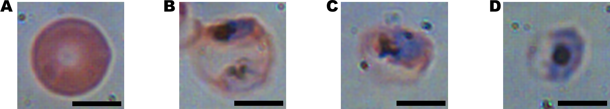
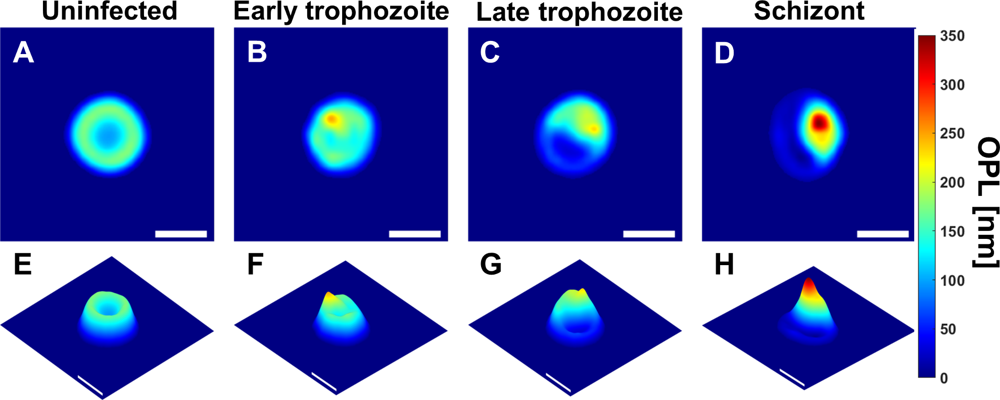

An introduction to caret
========================================================
author:
date:
autosize: true
transition: rotate
css: custom.css

Classification And Regression Trees
========================================================
The caret package was developed by Max Kuhn to:
- create a unified interface for modeling and prediction (interfaces to over 200 models)
- streamline model tuning using resampling
- provide a variety of “helper” functions and classes for day–to–day model building tasks
increase computational efficiency using parallel processing

<https://www.r-project.org/conferences/useR-2013/Tutorials/kuhn/user_caret_2up.pdf>

Syntax is inconsistent among R packages
========================================================

|obj Class  |Package |predict Function Syntax                  |
|:----------|:-------|:----------------------------------------|
|lda        |MASS    |predict(obj) (no options needed)         |
|glm        |stats   |predict(obj, type = "response")          |
|gbm        |gbm     |predict(obj, type = "response", n.trees) |
|mda        |mda     |predict(obj, type = "posterior")         |
|rpart      |rpart   |predict(obj, type = "prob")              |
|Weka       |RWeka   |predict(obj, type = "probability")       |
|LogitBoost |caTools |predict(obj, type = "raw", nIter)        |
https://www.r-project.org/conferences/useR-2013/Tutorials/kuhn/user_caret_2up.pdf

Available Models
========================================================

<https://topepo.github.io/caret/available-models.html>

Demo
========================================================
type:section

Algorithm: K nearest neighbours
========================================================

By Antti Ajanki AnAj - Own work, CC BY-SA 3.0, https://commons.wikimedia.org/w/index.php?curid=2170282

Data set: detection and staging of malaria infection
========================================================
Automated Detection of P. falciparum Using Machine Learning Algorithms with Quantitative Phase Images of Unstained Cells

Park HS, Rinehart MT, Walzer KA, Chi J-TA, Wax A (2016)

https://doi.org/10.1371/journal.pone.0163045

**A** uninfected, **B** early trophozoite, **C** late trophozoite, **D** schizont.

Malaria data set
========================================================

Optical path length images

Demo
=======================================================
type:alert

Resources
========================================================

- Manual: http://topepo.github.io/caret/index.html

- JSS Paper: http://www.jstatsoft.org/v28/i05/paper

- Book: http://appliedpredictivemodeling.com

